# Table of Contents

# E46 MODELS

# Subject

E46 Sedan and Coupe. . . . . ..3

E46/4 Sedan . . . .4

E46/2 Coupe. . . . ..6

Body   
Body Shell. .8   
Hood and Headlights. .9   
Doors. 10   
Door Anchoring System. 11   
Door Handles. 12   
Sunroof. . .13   
Interior Features. . . . .14   
Driver Information Displays. .15   
Seats. . 16

Power Distribution. . . ..18

Front Suspension. . . . .. 20

Rear Suspension. . . . .. 22

Final Drive. . . . 23

Brake System. . . .. 23

E46 Sport Wagon. . . ..24

Body Specifications . . . ..25

Body . . . . ...26

Interior. . . .. 27

# Subject Page

Rear Seats . . . ....27   
Center Arm Rest . . .28   
Child Seat Restraint 29   
Cargo Area . . 30   
Tailgate .. 32   
Emergency Release . .33   
Rear Window . .34

E46 Convertible. . . ...36

Introduction. . . .. 37

Technical Data. . . . .. 38

Body Shell   
Floor Pan. . . 40   
Windshiel Frame. 40   
Rear Bulkheads. .41   
Tension Strut. . .41   
Aluminum Support Plate. .41   
Rear Seats. . 42   
Variable Top Storage Compartment. .43

E46 All-Wheel Drive. . . . . ... .45

Introduction. . . . . . . . 46

# Chassis

# Front Axle. . . . . . . . . 48

Steering. . . . .. 49   
Differential and Front Axles. .50   
Rear Axle. .51   
Tires and Wheels. . 51

Transmissions. . . . . . . . .52

Transfer Case. . . .. . . . .53

Review Questions. . . . . ... .55

# E46 Sedan and Coupe

Model: E46/4: Sedan, E46/2: Coupe

Production Dates: E46/4 from 6/98, E46/2 from 6/99

# Objectives:

After Completing this module you should be able to:

Identify the location and purpose of the Door Anchoring Hooks.   
Describe the Suspension Systems used on the E46.   
Describe how to make a Camber adjustment to the front wheels.   
Identify vehicle fuse locations.

# E46/4 Sedan

The E46 is the successor to the E36 and is the next evolution in the 3 series development.   
The E46/4 Sedan was introduced as a 1999 model as both the 323i and 328i.

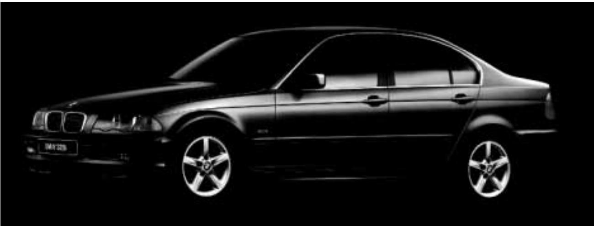

The E46 3 series vehicle offers more comfort, safety, space and equipment than the previous E36, without compromising the sporty characteristics of the 3 series vehicle.

Since start of production,two engine variants have been offered, the M52TU and the M54 six cylinders. Both engines introduced changes and design improvements that will be covered in the Engine and Engine Management chapters.

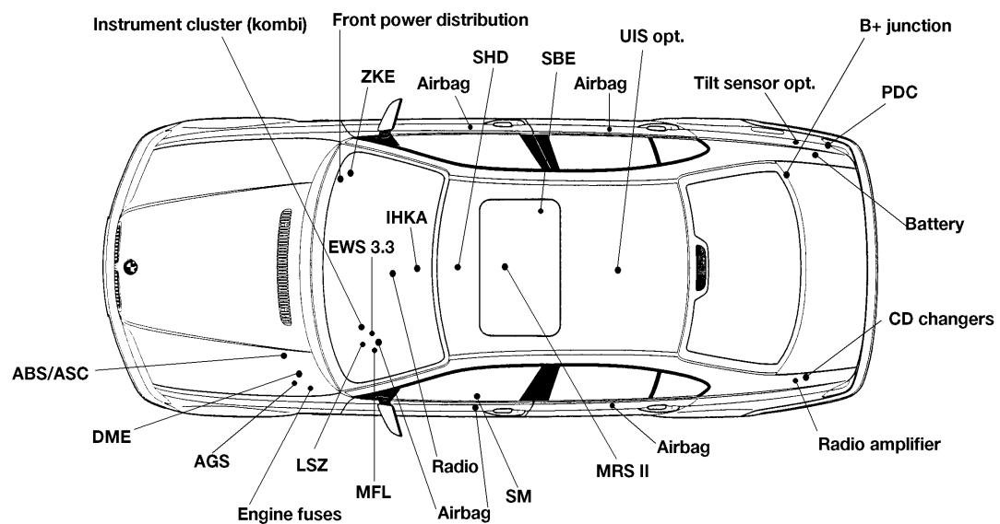

# E46/4 Dimensions

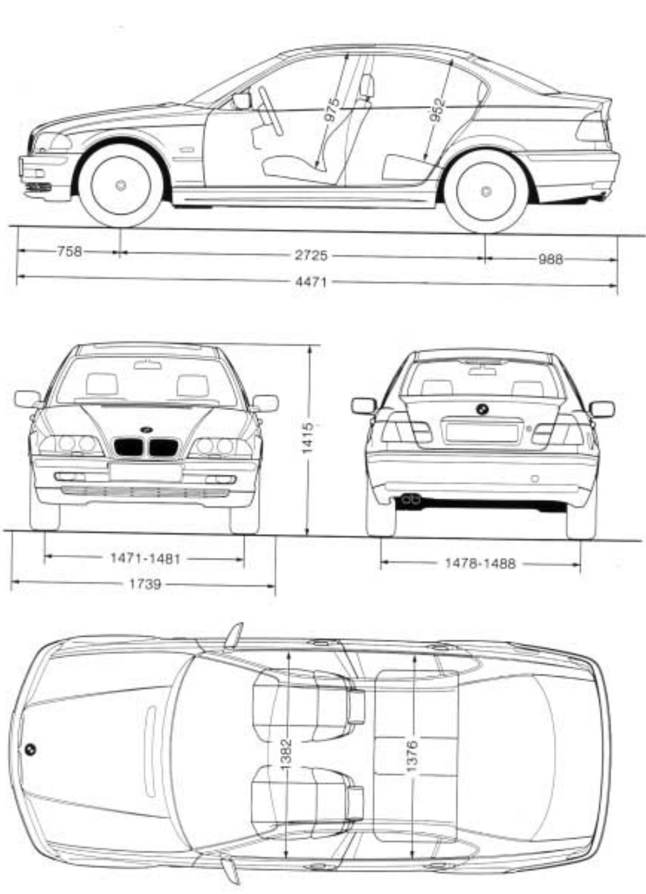

# E46/2 Coupe

The E46/2 Coupe was introduced as a 2000 model year vehicle in both 323Ci and 328C variants.

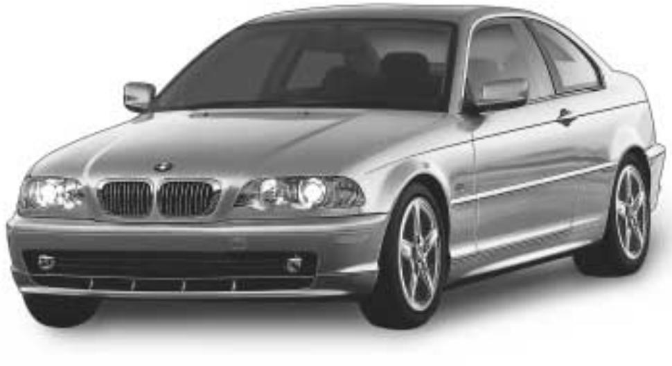

The body of the E46 /2 Coupe is not a modified sedan, but is a completely distinct body. There are no sheet metal parts shared between the Sedan and the Coupe Only the design technology of the E46/4 was used to create the E46 Coupe. The Coupe is even longer and wider than the sedan.

The E46 Coupes have been given the "Ci" (coupe injected) trunk badge designation. This is a departure from the "is" (injected sport) from previous 3 series coupes.

Since start of production,two engine variants have been offered, the M52TU and the M54 six cylinders. Both engines introduced changes and design improvements that will be covered in the Engine and Engine Management chapters.

# E46/2 Dimensions

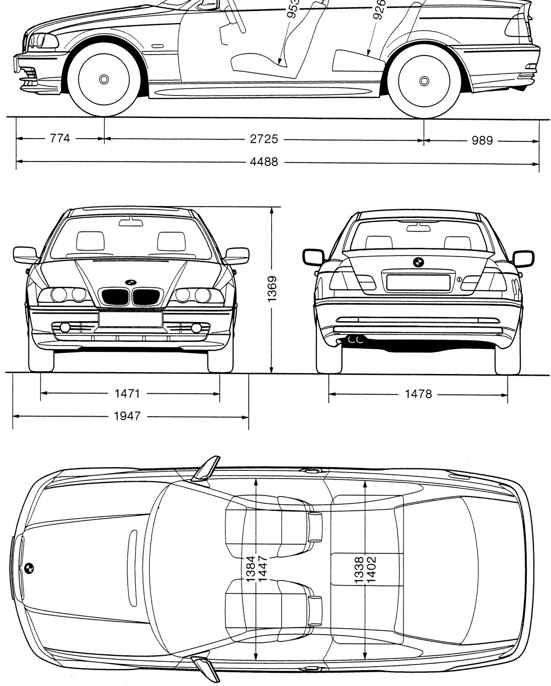

# Body

# Body Shell

The structural rigidity of the E46 body shell was increased using computer aided design (CAD) techniques. Every component of the new body structure was designed using this method. CAD allows the design to be translated into computer aided manufacturing (CAM) more efficiently. To reduce the weight of the vehicle, while retaining strength, high strength steels are used and now amount to $50 \%$ of the body shell weight.

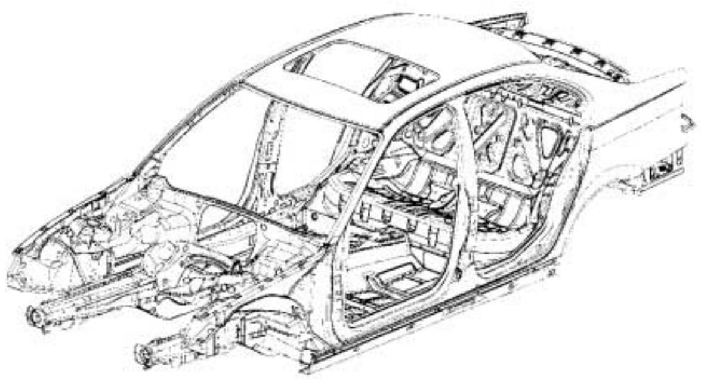

The second area of focus of the body shell is "structural dynamics". This deals with vibration frequencies that effect the ride quality and rigid feel. The E46 body shell was designed so that the frequencies for torsional twisting and bending are separated and are in an inaudible range. The ranges match the E39 for twisting at 29 hertz and bending at 26 hertz.

The E46 continues with BMW's safety cage concept for passenger protection. The tubular impact structures continue to provide protection against body damage during front or rear impacts.

The E46 is 1.8 times more able to absorb energy in a 40mph offset frontal crash than the E36.

# Hood and Headlights

The E46 follows the E38/E39 design with the kidney grille being integrated into the hood. The grille openings are more rounded and sweep down to the front bumper. The cowl opening is now integrated in the hood and is similar to the E38. The hood can be opened to a maximum of $9 0 ^ { \circ }$ , the workshop position, by disconnecting the gas struts and inserting a pin in the aligned holes.

The hood is opened by first pulling the release lever located inside the vehicle and then releasing the secondary catch that pops out of the grille.

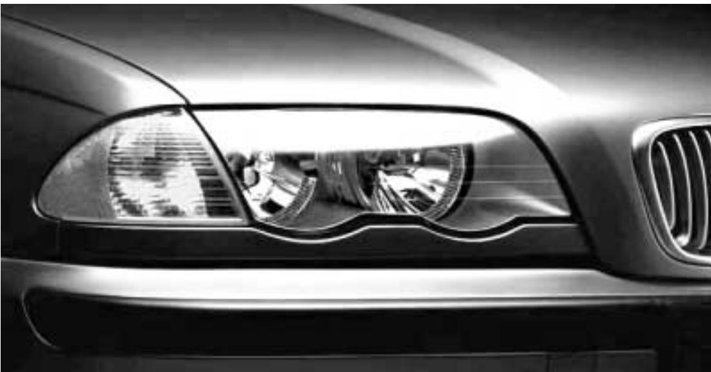

The E46 carries on with the traditional four head lamp configuration, however, no internal lens is used over each lamp. The free-form reflectors are clearly visible through the smooth, plastic covers. The plastic covers are lighter in weight and more resistant to breakage than the previous glass covers.

Vertical and horizontal adjustments for the head lamps are located on the upper rear edge of the assemblies.

Xenon low beam head lamps will be an available option starting with 9/98 production.

Xenon headlights are discussed in the E46 Driver Information Chapter.

# Doors

The doors on the E46 feature the door anchoring system introduced with the E38. The anchor consists of a horizontal bar in the door and a hook at the rear edge. The hook rests in a recess in the "B" and $" \textcircled { C } "$ pillars and it reinforces the body in the event of a side impact.

The door seal design is copied from the E39 and is a single piece seal.

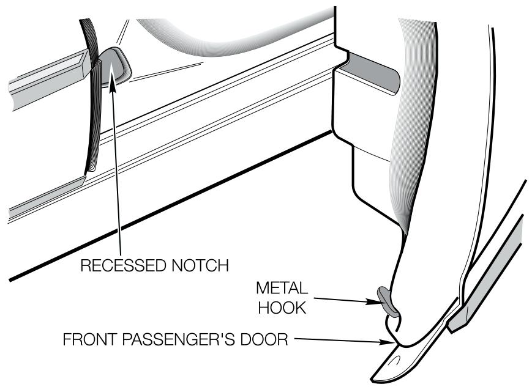

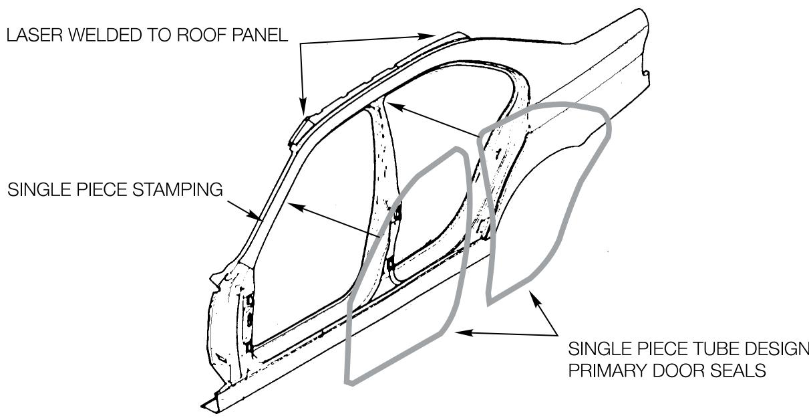

# Door Anchoring System

Cross section of driver's door and "B" pillar in the normal closed position.

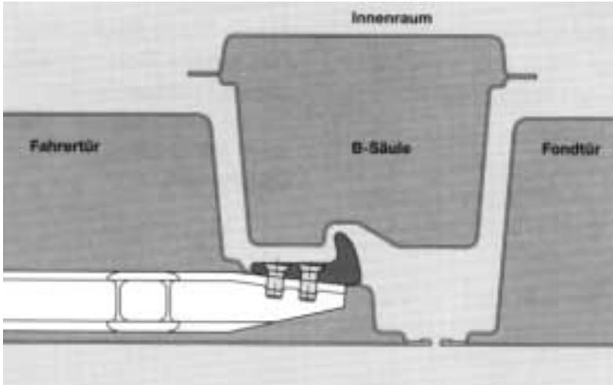

Upon severe impact, the hook locks into the recessed notch to provide a unitized side impact protection system.

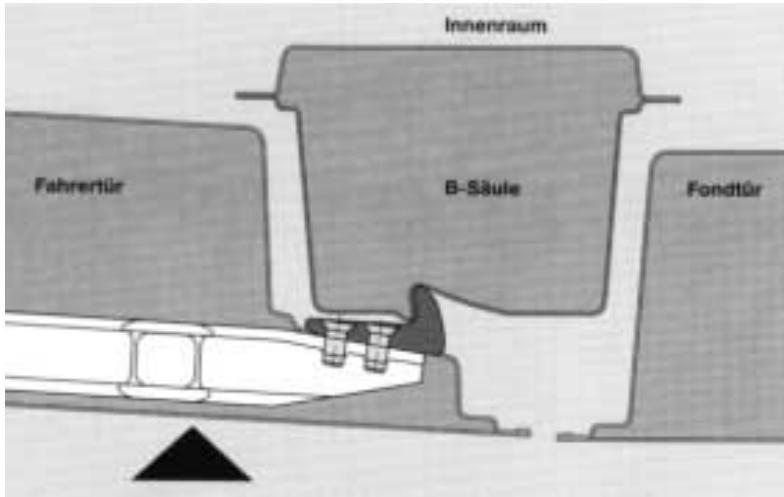

After impact, the door springs back and unhooks the notch.

The door is clear of the "B" pillar and can be opened.

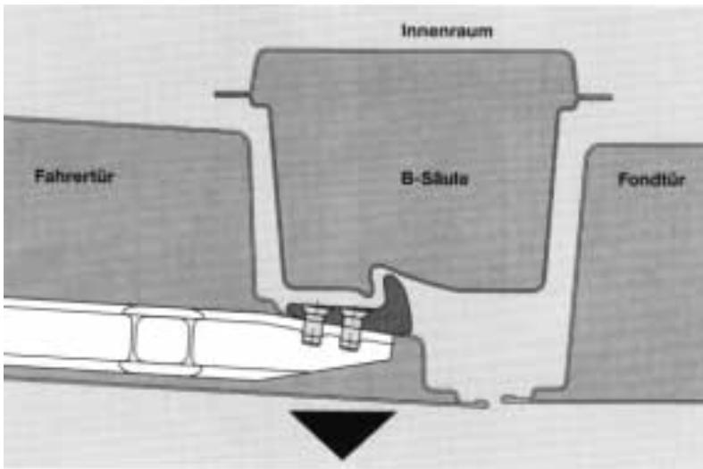

# Door Handles

The door handles and locking system on the E46 are of a new design. The new bow type handles allow the doors to be opened easier. The locks are fuly encapsulated including the electrical components. The new door handle/latch/lock assembly offers improved reliability and security against theft. The micro-switches for door position and lock condition have been replaced by hall sensors.

There are no serviceable components on the lock assembly and it must be replaced as a unit.

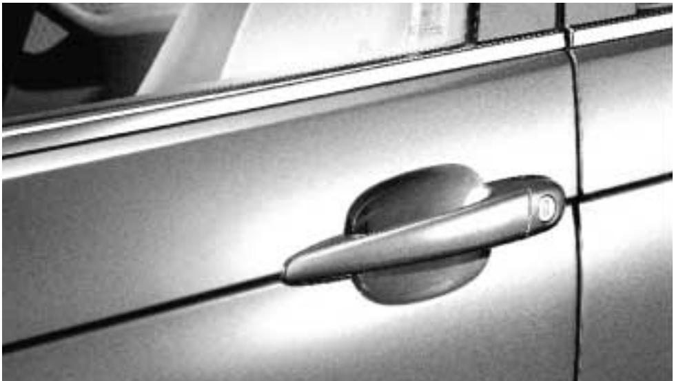

From September 2000 production, there was a modification done to the door handles of the E46. The modified door handles when pulled, fold upward instead of straight out as previous. The lock assembly was also modified to accommodate the new articulation of the door handles.

# Sunroof

The sunroof design is similar to the E38/E39, however, the sunroof cassette is not serviceable and must be replaced as a complete unit. The sunroof is an option on the E46 and will come with a glass panel (moon roof) instead of a steel panel.

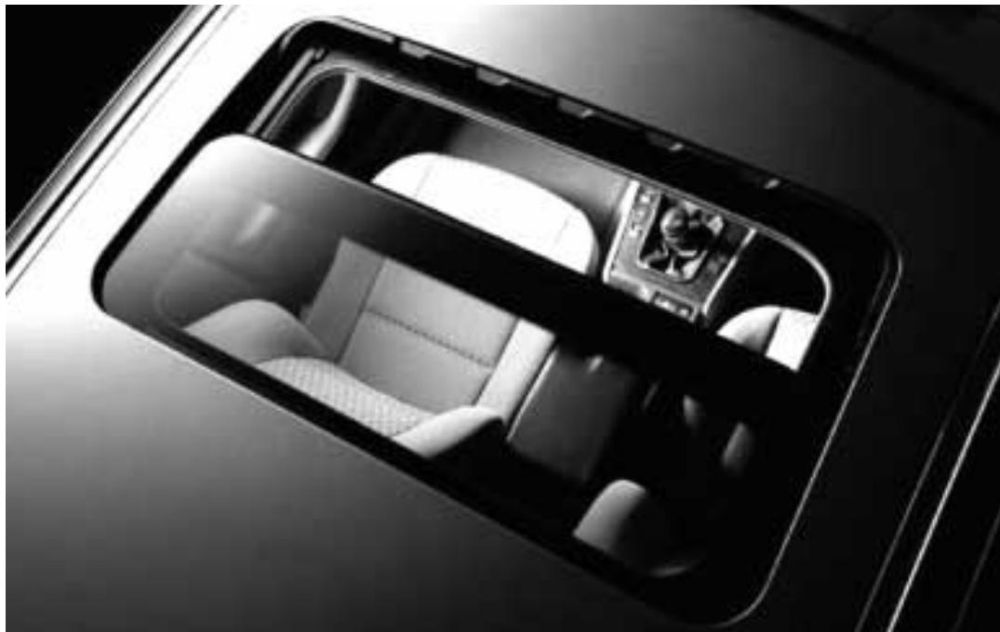

# Interior Features

The interior of the E46 has been completely redesigned with an emphasis on more space.   
luxury and convenience without compromising the 3 series sporty characteristics.

The new instrument panel/dash is similar in design to the E39 with a slightly less pronounced orientation to the driver. The E38/E39 type face vent grills are used for air distribution.

The multi-function steering wheel is available on both the 323/325 models and standard on 328/330 models. There are two different steering wheels available, the four spoke wheel with MFL and a three spoke sport wheel with MFL. The three spoke sport wheel is optional for sedans and standard in coupes. The MFL includes the controls for the audio system on the left and the cruise control on the right.

The E46 comes equipped with a manually adjustable (ilt/telescopic) steering column. There is 30 mm of vertical and horizontal adjustment for the steering column.

1. Spring Clamping mechanism 3. Steering lock with steering column tube

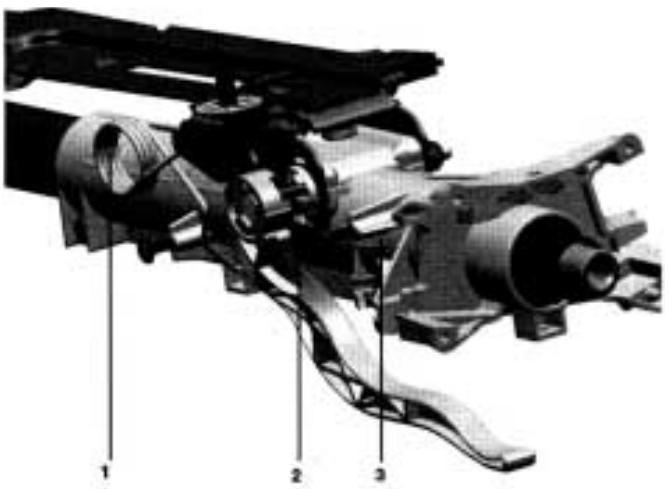

# Driver information Displays

The primary display for driver information is located in the instrument cluster. The coupe and sedan have different cluster lettering and faces. The secondary display in the console consists of the audio system and automatic climate control panel (if equipped with IHKA).

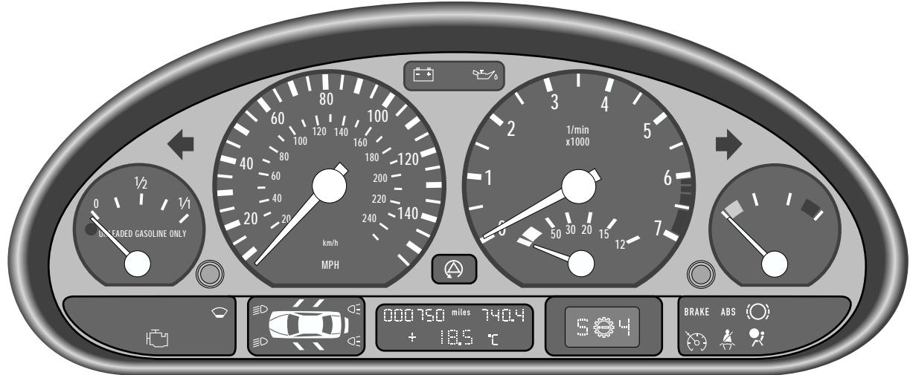

Two different radio types are available. One with the integrated tape player and the other radio incorporating a single in dash CD player.

Accessory switches are located in the console below the heater control panel. These include the ASC switch and the heated seat switches. Later production vehicles (2000 M.Y.) utilize the SZM (Center Console Switching Center) in place of the separate switches.

A new design (push to open/pull up to close) window switches are located in the center console on either side of the gear shift lever. The power window circuits include the one-touch and anti-trap features.

Instrument Cluster electronics and audio systems are covered in the E46 Driver Information Chapter.

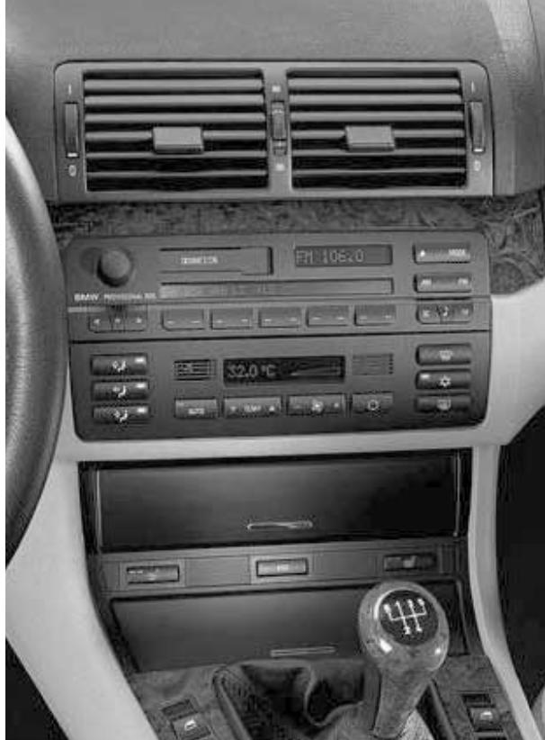

# Seats

The front seats are similar in design to the E36 seats with new internal construction to improve their support and comfort. Memory for the drivers seat position is available. The seat controls, including memory storage buttons are located on the side of the seat base. An optional lumbar support is also available for the E46.

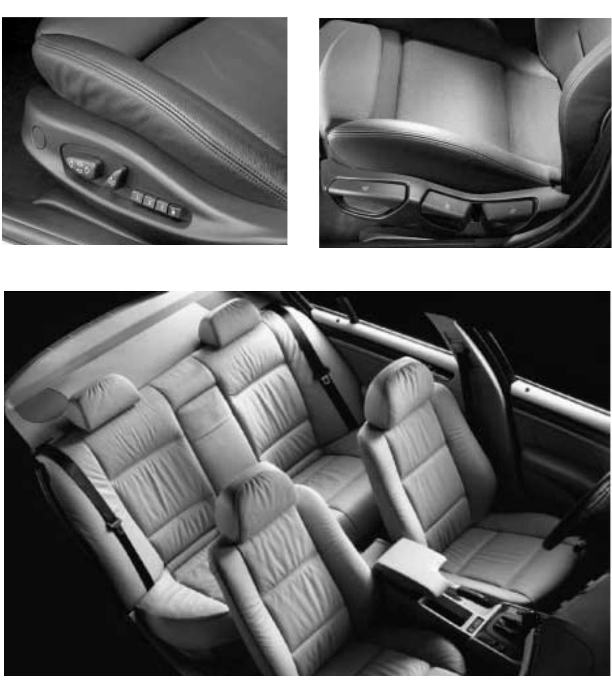

A split folding (40/60) seat is available as an option on sedans and standard on coupe models.

The release for the folding seat backs is located in the trunk on the let and right sides near the wheel arches. This increases the security aspect when keeping items locked in the trunk.

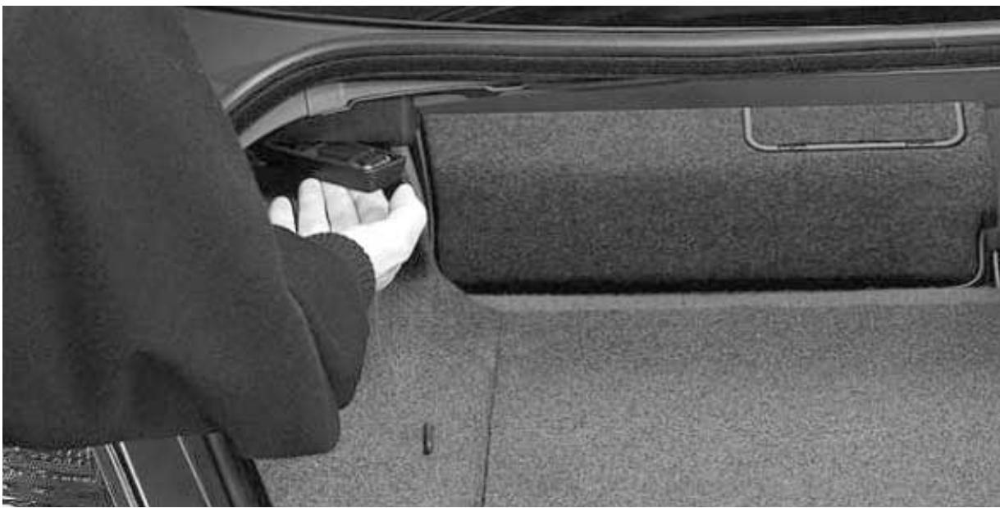

# Power Distribution

The battery is installed in the trunk of the E46 and features lead/calcium plate material for true maintenance free operation. The water usage of this battery is low throughout its service life.

The Battery Safety Terminal is installed at the positive terminal of the battery.A repair kit is available for the BST.

The E46 is produced with a vehicle specific wiring harness. This harness is based on the ordered optional equipment of the vehicle so that it contains the proper connectors and connections. Options can not be added at a later time without replacing the entire harness.

Specific kits are available to repair the harness in the event of an accident or damage to the harness. These repair kits include:

Engine compartment Vehicle's rear area

If the entire harness need to be replaced, a new harness with the maximum equipment or options must be ordered. This is the only harness that will be stocked in the parts system.

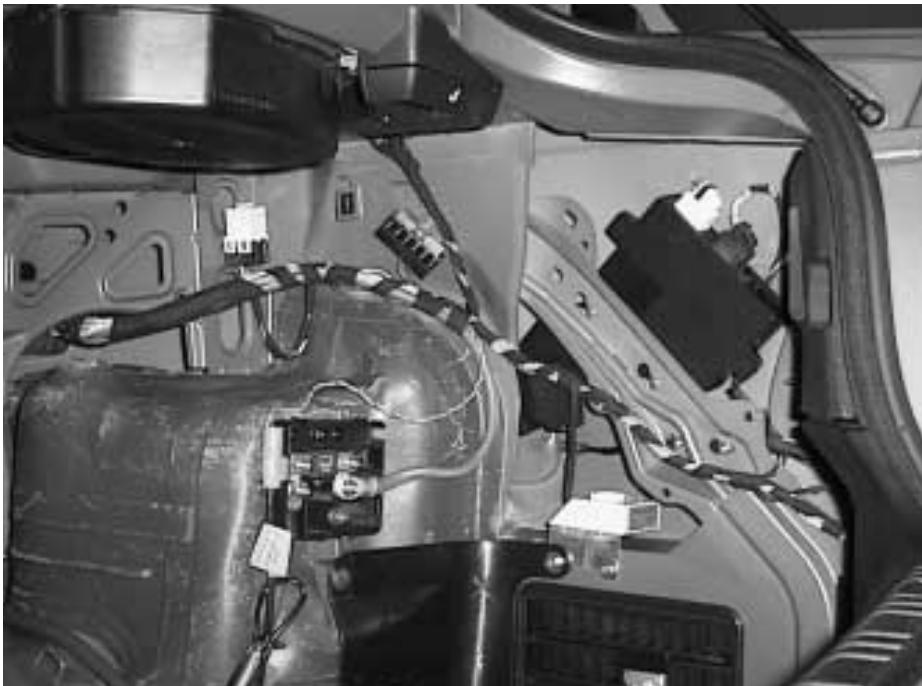

There are three locations for fuses on the E46:

The fuse holder above the glove box The E-Box in the engine compartment In the trunk near the battery

The E46 uses high amperage fuses for circuit protection. The battery power supply is protected by a 250 amp fuse in the trunk.

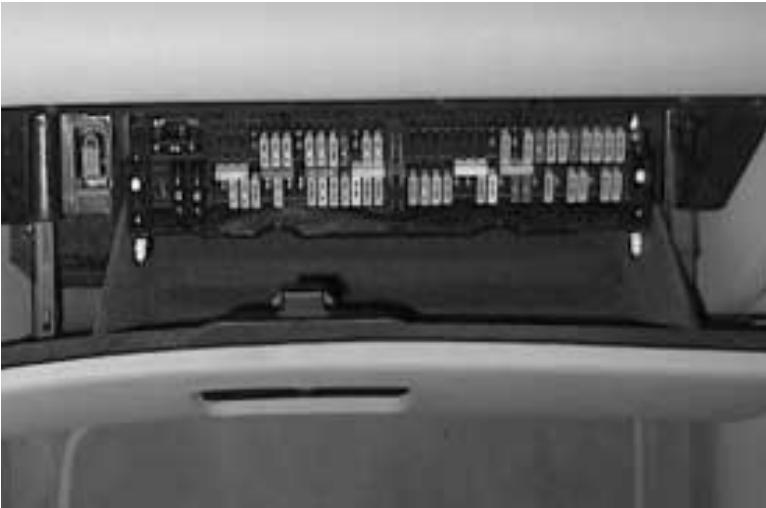

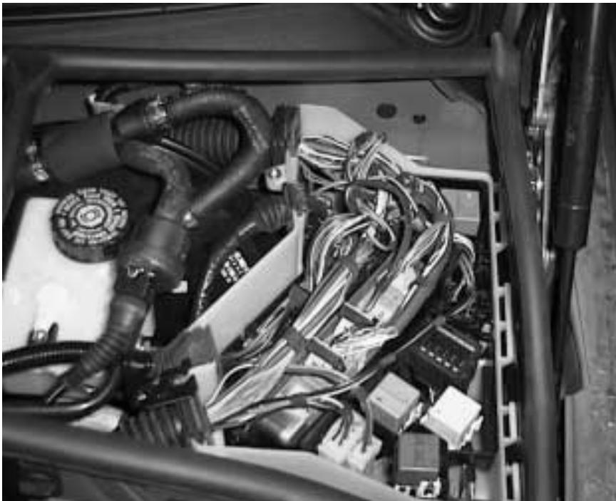

# Front Suspension

Tsigle bal jont ru axlef the   ba nh desi. Deig ancp nent changes were developed to improve the ride quality and handling characteristics. The following changes are incorporated into the E46 front suspension system:

A new forged aluminum control arm is used on the E46 (except all-wheel drive). It offers the advantages of weight reduction and lower unsprung mass.

Hydraulic bushings are used for the rear lower control arm support.

Hollow strut piston rods are used to reduce weight

The steering knuckles are press fit into the strut tubes which reduces the tolerances of the front suspension geometry.

The caster has been increased to improve straight line stability.

The track has been widened for improved cornering.

Aluminum brake dust shields are used for weight reduction

Altogether there is 5.72 lbs less unsprung weight in the front suspension which enhances ride comfort and handling.

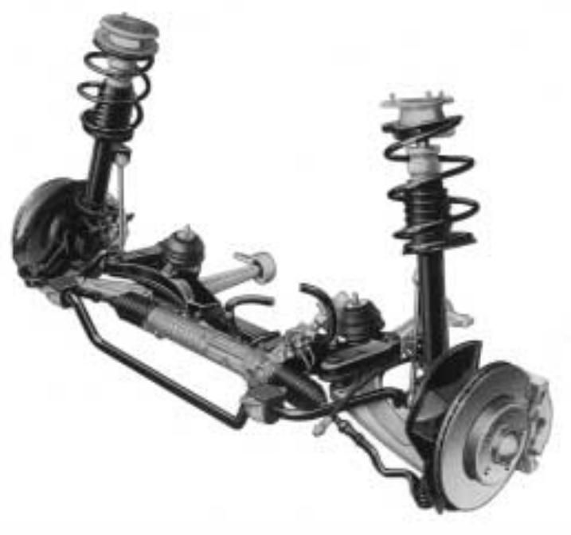

# Front Camber Adjustment

The top of the strut is mounted through elongated holes. The strut is fixed in position when the vehicle is assembled. If minor corrections need to be made to the front end alignment, the pin can be driven down and the strut can be moved in the slots to adjust the camber. Approximately $5 ^ { \circ }$ of adjustment is available by moving the strut in the slots.

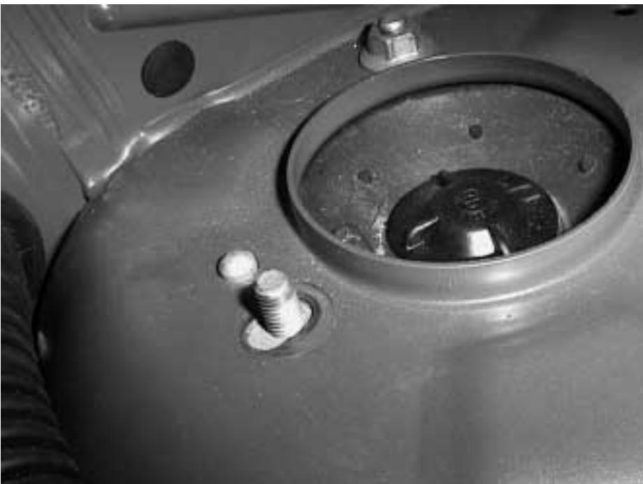

Follow the instructions for making the Camber adjustment described in Repair Manual 32 00 610.

Use Special Tool 32 3 140 to make the adjustment.

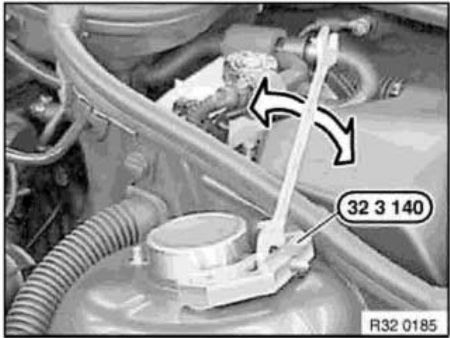

# Rear Suspension

The design of the E46 rear suspension is based on the E36 "C" arm type. However, all components of the suspension are new and designed to suit the E46 for:

Comfort and convenience Handling and stability Noise reduction

The sub frame is a new design employing steel tubes and metal sections. It is more rigid than the previous sub frame. This provides a stable platform for the rear suspension to work from. The differential is mounted to the sub frame using a hydraulic mount. The sub frame is mounted to the body at four vibration absorbing rubber mounts.

The upper transverse control arms are made from cast aluminum for weight saving.

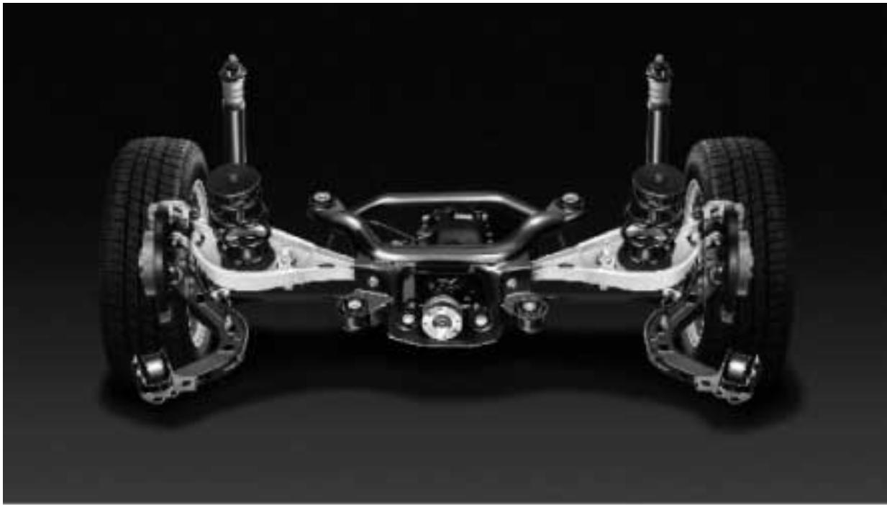

# Final Drive

The final drive is the compact (HAG 188K) type that is lighter in weight than the type used on the E36. Features of the compact final drive assembly include:

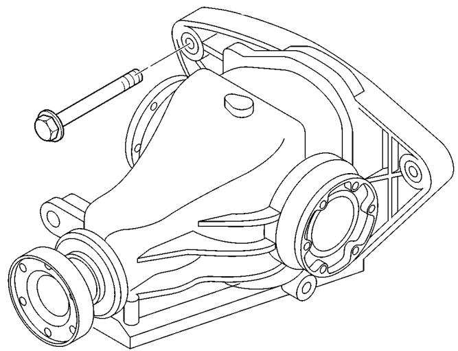

Compact housing   
Shorter pinion shaft   
Hollow drive flange shafts   
No side bearing covers   
Elimination of speedometer gear   
Lifetime synthetic oil

Limited slip differential is no longer possible with the compact differential.

The drive shaft and differential are now mounted on the center line of the vehicle. This enables the transmission tunnel to be narrower increasing the interior passenger space. With this change, the axle shafts are now different in length and are no longer interchangeable.

# Brake System

The braking system is upgraded for the E46 to match the vehicle's size and braking requirements. The dual circuit (front/back) distribution system continues to be used for optimized braking response and performance. Refinements to the brake pedal linkage increase the brake response time to improve braking performance.

Single piston floating calipers with vented rotors are used on the front and rear brakes.

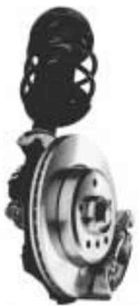

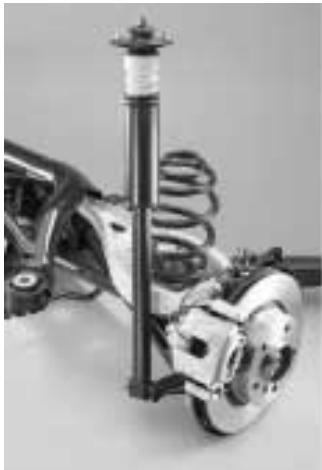

The E46 uses a $1 0 "$ vacuum booster, vented in the engine compartment to reduce noise in the passenger compartment.

# E46 SPORT WAGON

Model: E46/3

# Production: 1/00

# Objectives:

After completing this module you should be able to:

Identify the changes to the body of the E46 for the Sport Wagon.

List the changes to the interior of the E46 Sport Wagon.

Discuss the operation of the rear tailgate/window system.

The E46/3 "Sport Wagon" is being introduced to the US market as a 2001 Model Year vehicle. It joins the highly successful Sedan and Coupe models to further enhance the product line up and offer 3 series customers an alternative choice of vehicle.

Up to the "B" pilars, the Sport wagon is identical to the E46 sedan. The rear doors have been remodeled for wagon usage and the tail gate is similar to the E39 Sport Wagon with an opening rear window.

The rear seats fold down to provide 1345 liters of cargo space. With the seats up, the rear compartment provides 435 liters of load space.

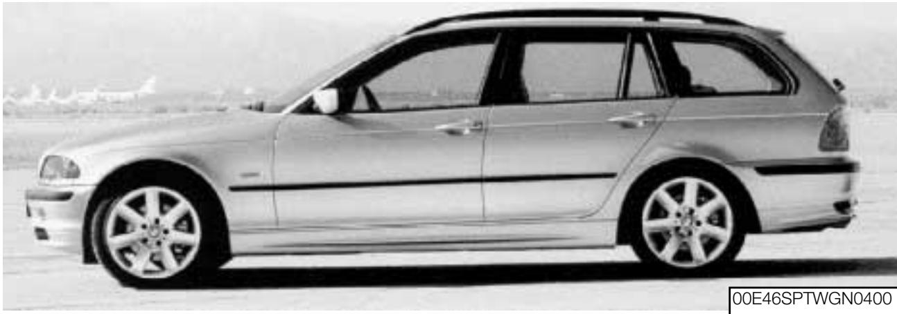

# BODY SPECIFICATIONS

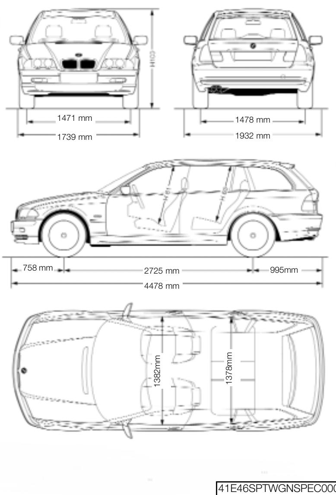

The E46 Sport Wagon is 7 mm longer that the sedan and the unloaded height is 6 mm lower. The wheel base, width and turning radius are the same as the E46 sedan. The following are the maximum cargo capacity/ loads:

435 Liters luggage capacity - with rear seat back up   
1345 Liters luggage capacity - with back rest down   
540KG in the rear   
75 KG on the roof.

# Body

From the front bumper up to the "B" pillar the E46 Sport Wagon body is identical to the sedan. From the "B" pillar rearward, the body shell of the Sport Wagon is all new and includes:

New Rear doors   
New Tailgate and hinge mechanism   
New Frameless rear window   
New Rear Bumper   
No tail gate lock cylinder   
Roof rails as optional equipment

The structural rigidity and "structural dynamic" characteristics introduced with the E46 sedan are carried over to the E46 Sport wagon. As with the sedan and coupe, the Sport Wagon body shell acts as the passenger's safety cage along with the tubular impact structures for the front and rear bumper mountings.

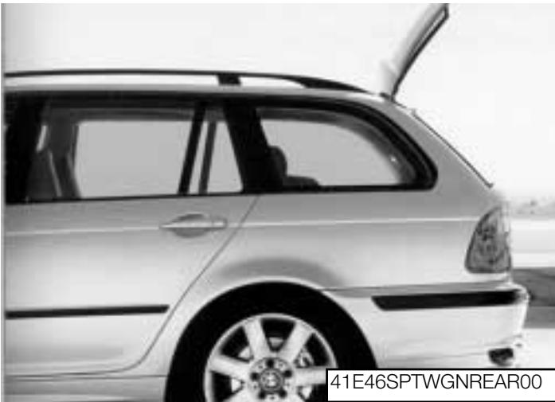

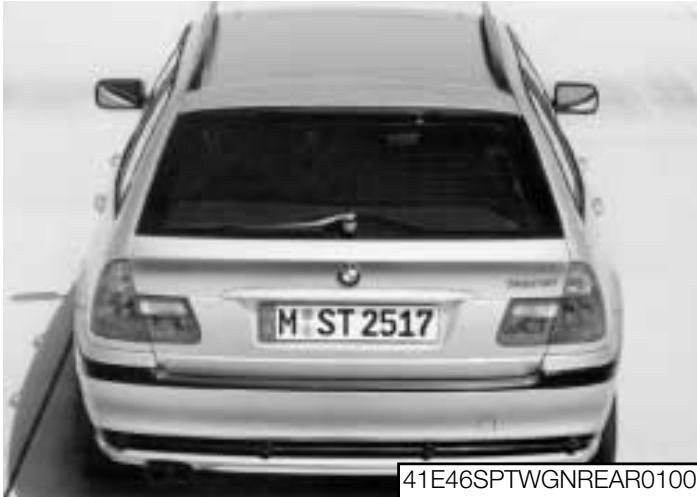

# Interior

Up to the "B" pillar, the interior equipment and trim level corresponds to the E46 sedan. The front seat options are the same as the E46 Sedan, while the rear seating area has been newly designed to provide an attractive package that offers optimum functionality and useable space when the seats are folded down for cargo loading.

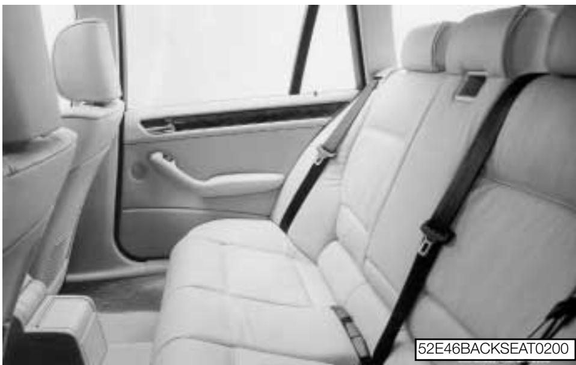

The rear seats backs are a 60/40 split with the center arm rest section on the left seat back. The center passenger's inertia reel is mounted to the left seat back, while the left/right rear passenger's belt reels are mounted on the wheel housings. The lower section of the seat back is separate foam piece that enables the back rest pivot point to be higher on the seat back. This allows the back rest to fold flat for more useable cargo loading space.

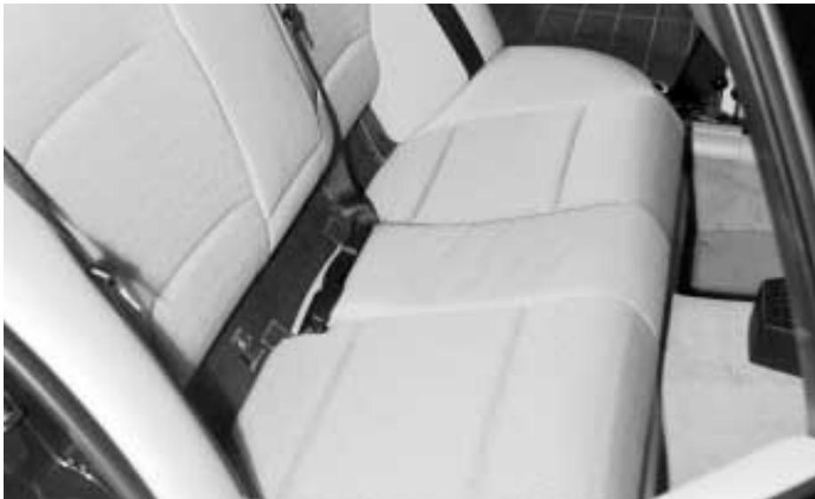

# Center Arm Rest

The center arm rest incorporates the non-adjustable center head rest. The center arm rest is folded down to gain access to the storage compartment and cup holders , which are integrated into the rear of the head rest.

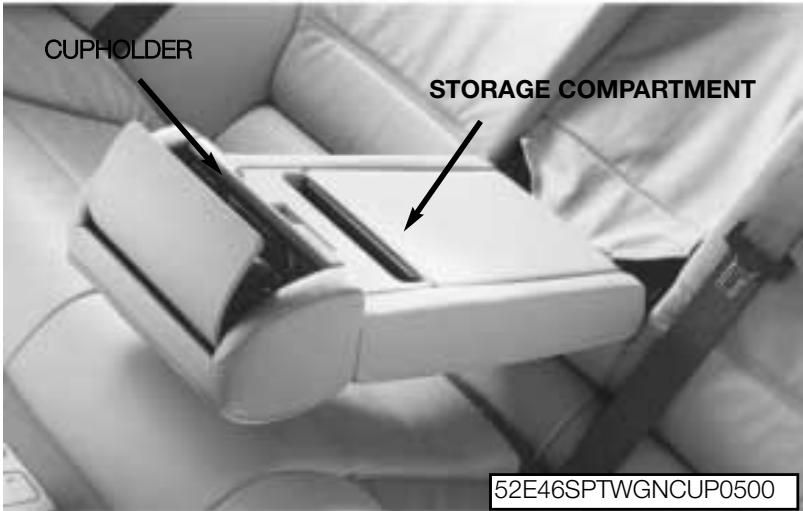

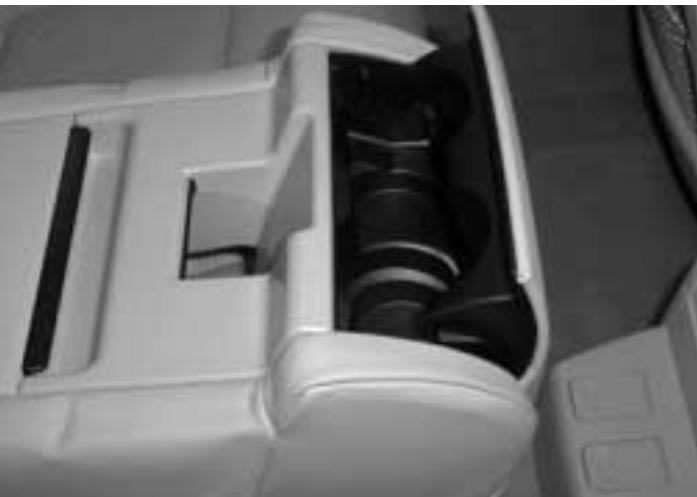

# Child Seat Anchor

There are three child seat hold down anchors positioned behind the rear seat back rest. The plastic covers must be removed to access the hold down anchors,

I .

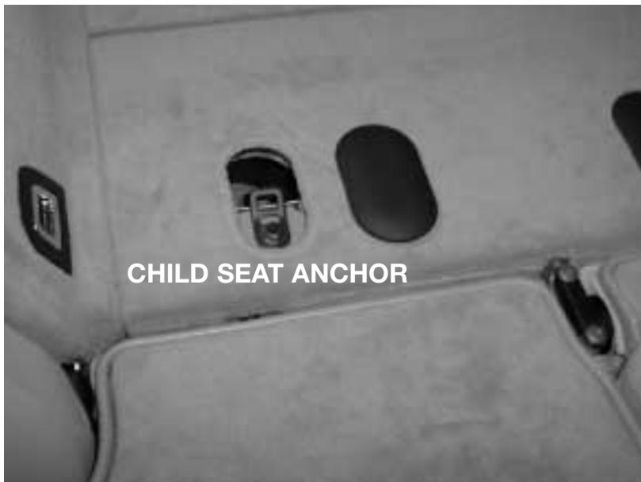

# Cargo area

The cargo area offers 435 liters of cargo space with the rear seat back rest raised and 1345 liters with it lowered. The cargo area offers a spring loaded - roller blind and cargo net similar to the E39 Sport Wagon.

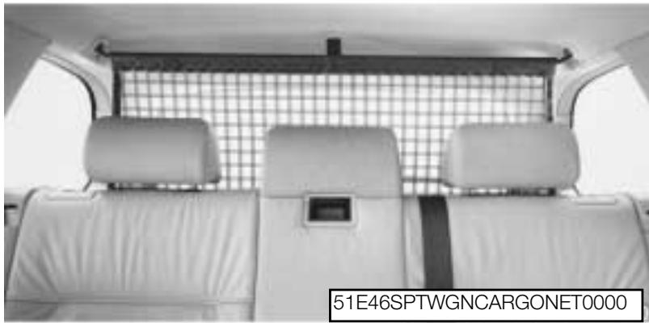

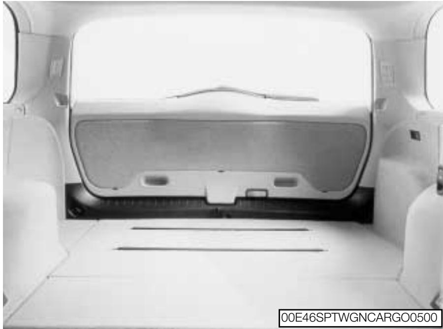

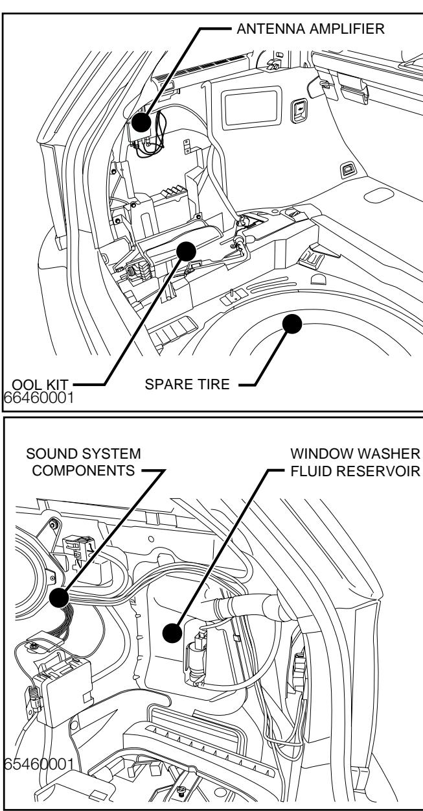

# Storage Compartments

Storage areas on the left and right in the rear are used to house the rear window washer fluid reservoir on the right and various sound system components on the left.

# Load Floor/Spare

The load floor is removable to access the spare tire and control module mounting area located beneath. A strap is provided to hold the load floor up while accessing the storage area. The interior trim panel must also be removed for access to the spare and control modules.

# Power Socket

A 12 Volt power socket is installed on the left side of the cargo area behind the rear seat back.

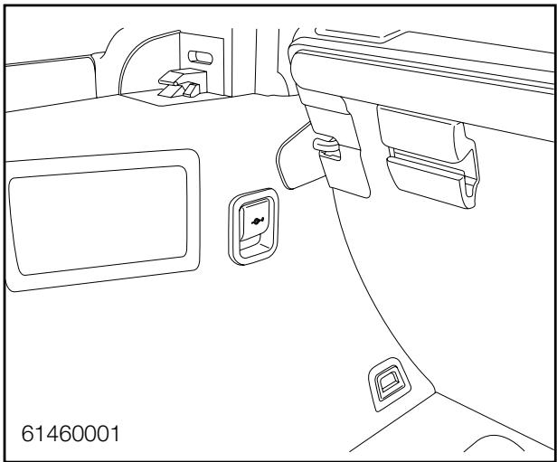

# Tail gate

The tail gate is similar in design to the E39 Sport Wagon, including the rear glass that is hinged separately and can be opened independently from the tail gate.

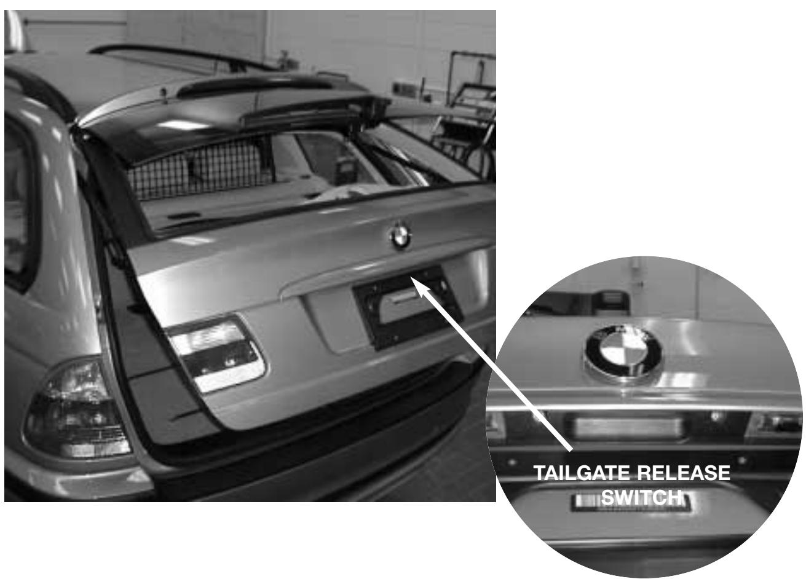

# Rear Actuator

The actuator for the tailgate release is mounted on the rear apron behind the trim panel. Control of the actuator is a function of the GM - ZKE system.

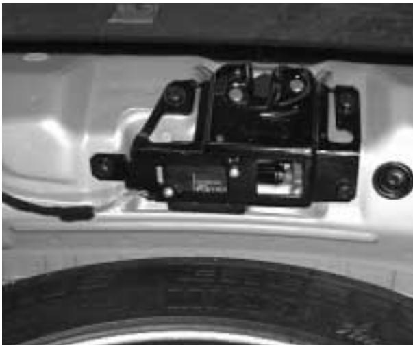

# Emergency Release

The tailgate does not feature a lock cylinder so an emergency release mechanism is incorporated into the tail gate latch. It allows mechanical opening of the gate actuator in the event of an electrical failure. The release is located along the lower edge of the rear apron behind a small access cover. After removing the cover, the lever is pushed to the right to mechanically release the tail gate.

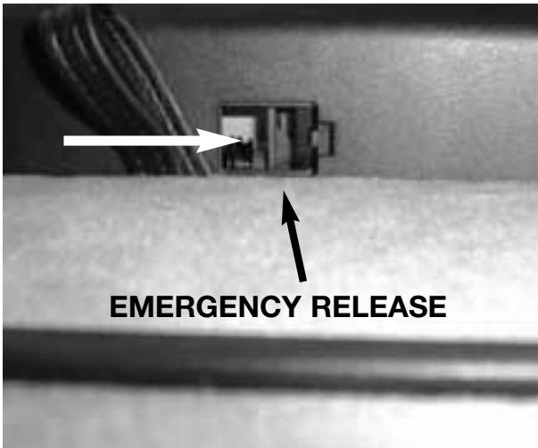

The rear apron of the E46 Sport Wagon is lowered for easier loading/unloading. A plastic rubbing strip prevents the bumper from being scratched when cargo is being loaded/unloaded.

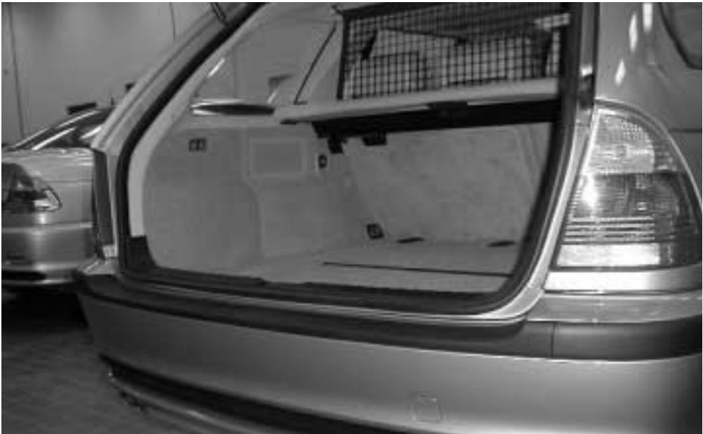

# Rear Window

The Frameless rear window is bonded to a metal carrier which is hinged to the body. If the rear window needs replacement, it is supplied with the glass bonded to the metal carrier.

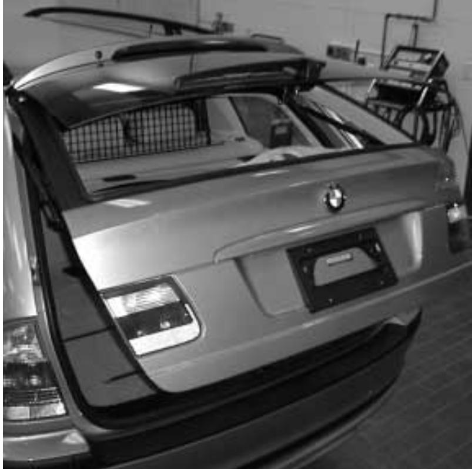

The release switch for opening the rear glass is incorporates into the rear wiper arm cover under the triangle trim plate.

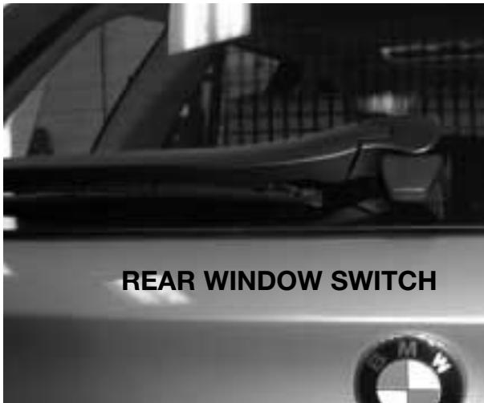

# Rear Glass Hinge

The hinges are a new design (torsional coil spring) that are compact in shape for space saving reasons.

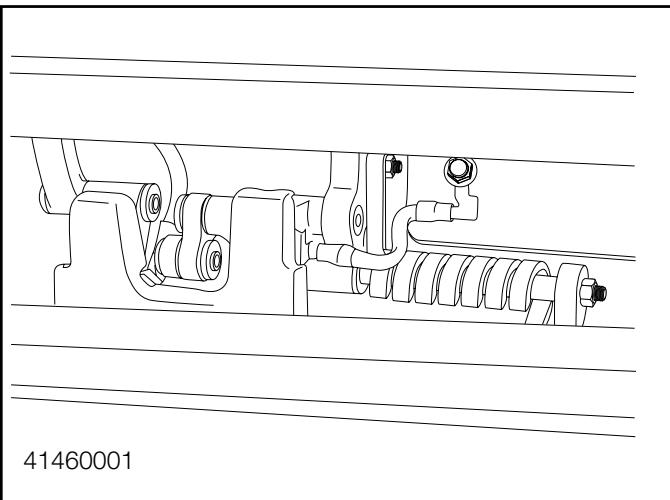

The rear window is adjusted through the slotted mounted bolts. The gap of the window should be uniform on all sides. The height of the rear window is adjusted using shims on the hinge mounts. Refer to the repair manual for complete adjustment procedures and sequence.

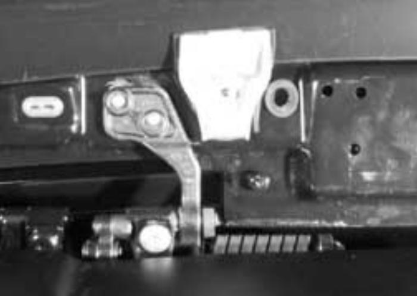

# Rear Washer Nozzle

The rear window washer spray nozzle, as well as the third brake light, is mounted at the top left side integrated into the spoiler.

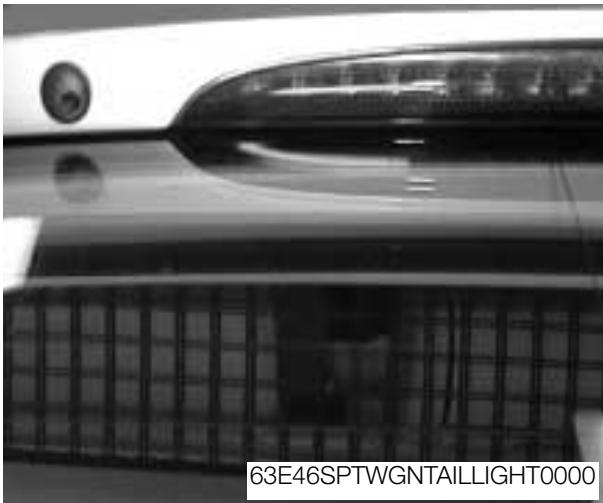

# E46 Convertible

Model: E46/2C

# Production: 01/00

# Objectives:

After completing this module, you should be able to:

Describe how the body shl is reinforced to improve Torsional Rigidity   
Identify the floor pan reinforcements for energy absorption on the SGS seats. Identify the body shell reinforcements necessary for the addition of the Variable Convertible Top Storage Compartment Floor. Describe how the windshield frame is reinforced.   
Identify and describe the functions of the Tension Strut.   
Identify and describe the function of the Aluminum plate.

# Introduction

The E46 Convertible is the replacement for the E36 Convertible and is based on the E46 Coupe. It is initially being introduced in March 2000, as a 323 Model only with the M52 TU 2.5 liter engine. The 3 liter version of the E46iC will begin production starting in 6/2000.

The E46 323 features a new design top that consists of a three layer top and all glass rear window. The 323 comes with a manual top as standard equipment. The new fully automatic electro-hydraulic top is available as an option. The 330 E46iC will come with the fully automatic top as standard equipment.

The roll over protection system is standard equipment and is similar in design to the E36 system. The roll over protection bars are hidden by the rear headrest and deployed under the same criteria as the E36 system.

The front seats of the E46iC are a new design with the seat integrated belt (SGS) systen similar to the system introduced on the E31 - 8 series vehicles.

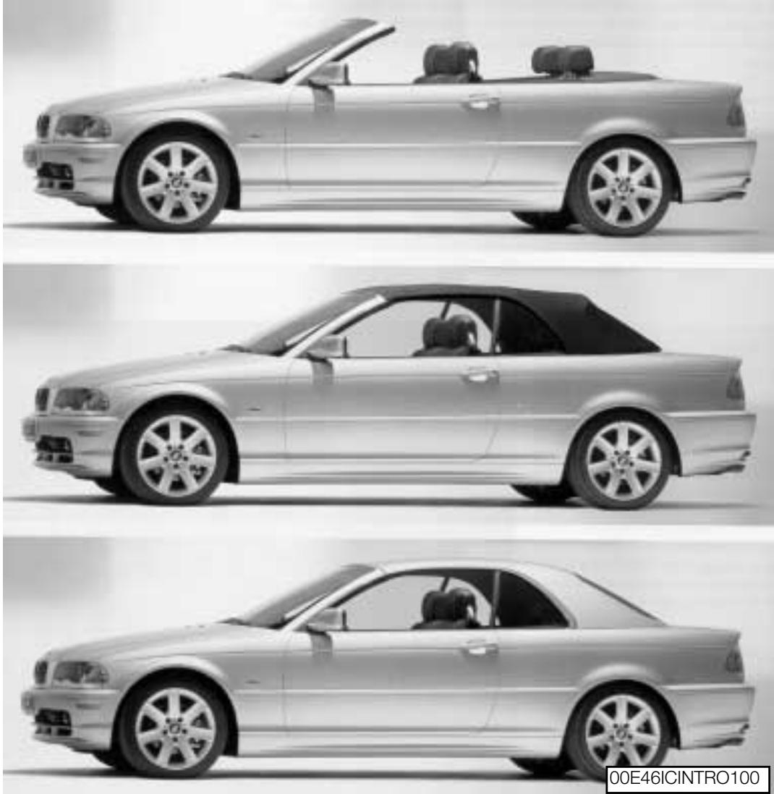

<table><tr><td colspan="3">Outside Car Dimensions</td></tr><tr><td>Length (mm) Width (mm) (With Mirrors) Height (mm)</td><td>4433 1710 (1875) 1648</td><td>4488 1757 (1947) 1672</td></tr><tr><td colspan="3">Inside Car Dimensions</td></tr><tr><td>Shoulder Room, front (mm) Shoulder Room, rear (mm) Elbow Room, front (mm)</td><td>1352 1108 1412</td><td>1384 1165 1443</td></tr><tr><td>Elbow Room, rear (mm) Effective headroom, front (mm) Effective headroom, rear (mm)</td><td>1120 968 921</td><td>1208 974 937</td></tr><tr><td colspan="3">General Information</td></tr><tr><td>Cd Unladen weight</td><td>0.36 3319 (3396 auto)</td><td>0.36 3516 (3649 auto)</td></tr><tr><td>Total Weight Luggage Comp. Volume (L) (Comp Floor Extended</td><td>4035 (4112 auto) 230</td><td>4322 (4410 auto) 260 (300)</td></tr><tr><td colspan="3">Speed Rating</td></tr><tr><td rowspan="3">Top Speed (MPH) Acceleration 0-60 MPH (Sec.)</td><td></td><td>128</td></tr><tr><td>128 governed</td><td>governed</td></tr><tr><td>7.7 8.8 auto</td><td>8.8 9.7 auto</td></tr></table>

# Body Shell

The body shell of the E46iC has been developed specifically for the convertible to improve crash performance which is similar to the E46 Coupe. This was achieved by the use of reinforcements on the body shell that improved torsional rigidity (body twisting). In the main body floor pan, reinforcements were necessary to accommodate the new SGs (Seat Integrated Belt System) seat system. In the rear floor pan, reinforcements were necessary to account for the variable convertible top storage. compartment floor.

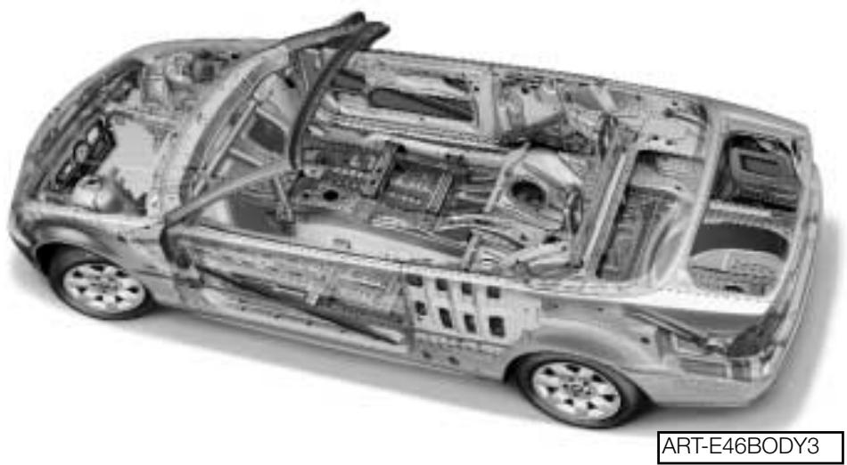

# Components

# Floor Pan

The floor pan is reinforced to support the SGS seat by heavier cross brace members, reinforced tunnel/floor pan and reinforced engine support brackets. During a collision all forces occurring on the seat are channeled to be absorbed by the floor pan.

# Windshield Frame

The windshield frame is reinforced with stepped reinforcing tubes to allow it to act as a roll-over protection. During the rollover all of the forces exerted on the A-pillar of the windshield frame are transmitted as a Moment (Torque) to the bottom of the Apillar where stepped reinforced tubes are reinforced.

# Rear Bulkheads

The rear bulkheads are redesigned to support the rollover protection and seat belts. They are welded to increase structural rigidity and to secure rear seat, rear seat belts and the mounting point for the ISO child seat.

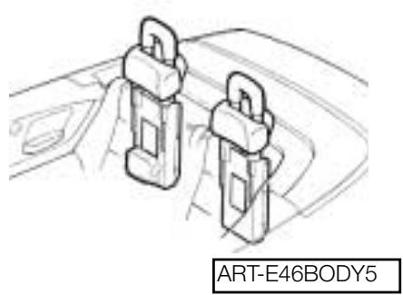

# Variable Top Storage Compartment

The variable top storage compartment is reinforced to make the top storage compartment rigid and stronger, not to allow twisting moments when the soft top is in its compartment or when the compartment is opened to enlarge the storage area.

# Tension Strut

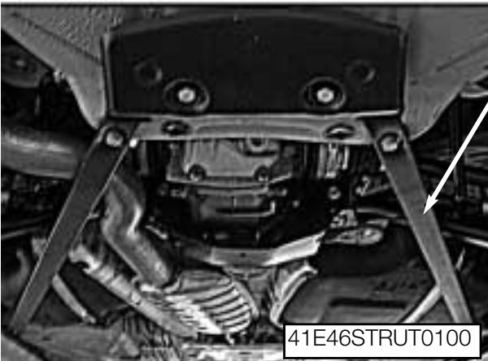

# Aluminum Support Plate

An aluminum support plate is incorporated into the front suspension carrier to achieve a high degree of rigidity combined with low weight.

All of these design improvements increased the E46iC torsional rigidity by $50 \%$ compared to the E36iC:

Tension struts are integrated into the rear of the body shell to improve the torsional rigidity by not allowing body twist in the rear. It also keeps the rear end of the car intact with the middle floor pan.

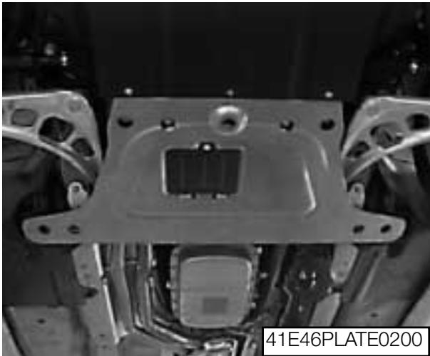

E36 Convertible Torsional Rigidity 6000Nm/degree E46 Convertible Torsional Rigidity 9000 Nm/degree

# REAR SEATS

The E46iC is designed as a four passenger vehicle. Only two seat belts are installed in the rear that correspond to the seat belt system of the E36iC.

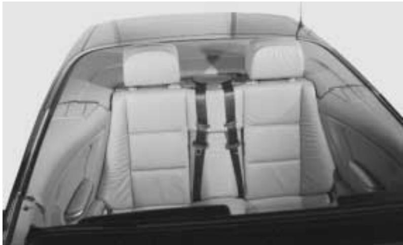

The E46iC is equipped with child seat mounting brackets on the left and right sides below the seat base. The brackets conform to ISO (International Organization of Standardization) for placement on the rear floor pan. Any ISO child seat can be installed by simply sliding the seat into position between the seat base and backrest and locking it into place.

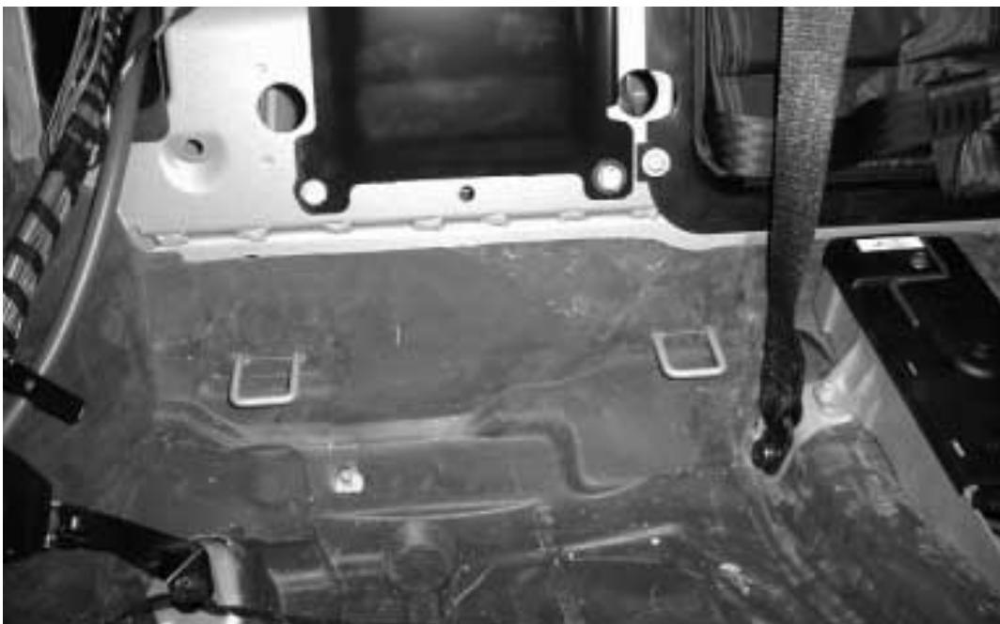

# VARIABLE CONVERTIBLE TOP STORAGE COMPARTMENT FLOOR

# Purpose of the System:

The trunk of the E46 convertible offers a new feature called the "Variable Convertible Top Storage Compartment Floor". This feature allows the luggage storage area to be enlarged by approximately 40 liters when the soft top is raised or removed for hard top installation.

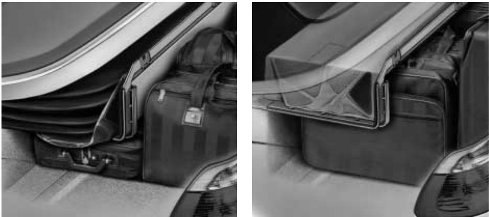

# Components of the system:

# Variable Compartment Floor

The variable compartment floor is constructed of plastic with fabric covering. It is hinged mechanically so that it can be rotated up into the top storage area providing additional luggage storage space in the trunk. The floor is hinged at four points to allow it to articulate and fold upwards:

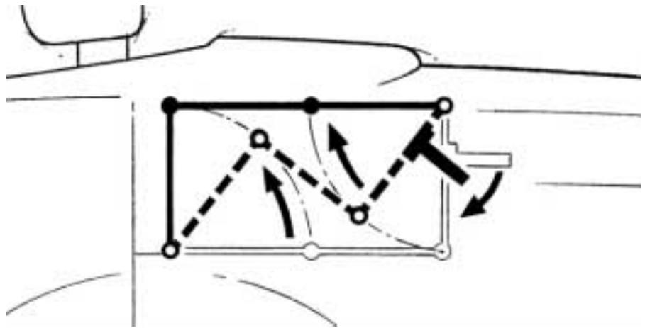

# Actuating Lever

An actuating lever is integrated in the variable compartment floor on the right side. It allows the compartment floor to be opened and closed using the actuating lever. It also locks the compartment floor into position.

# Dampening Piston

A dampening piston is also integrated in the variable compartment floor on the right side. It assists in the movement of the variable compartment floor to either position and keep it fixed in that set position (retracted or extended). The lower dampening piston hinge switches the micro switch integrated on the right side of the compartment floor when the variable compartment floor is in the raised position. This signal is provided to the CVM to lock out the operation of the convertible-top.

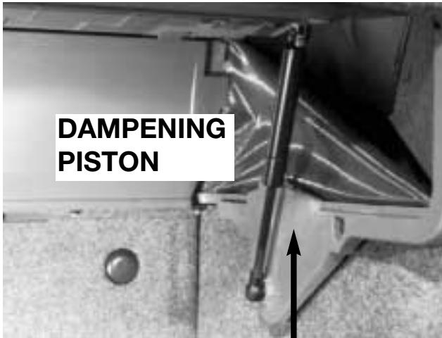

MICRO-SWITCH

# System Operation:

# Opening the variable compartment floor

The convertible top must be raised or removed from the storage compartment.   
Pull the actuating lever rear wards and push it down and toward the rear bulkhead.

# Closing the variable compartment floor

Pull the actuating lever down.   
Pull the compartment floor rear wards to close the floor.

E46 ALL-WHEEL DRIVE SYSTEM

Model: E46/16 (330xi/A, 325xi/A, 325xi/A Sport Wagon).

Production date: 330xi 8/00, 325xi 9/00.

# Objectives

After completing this module you should be able to:

Identify the changes made to the E46 to accommodate all-wheel drive.

Understand the construction of the NV124 transfer case.

# Introduction

The E46/16 introduces the return of the BMW all-wheel drive car to the United States. This t ll-heel drive wil be option (SA 03), available on 6 sdans and Sport Wagos beginning 2001M.Y.

Vehicles with the all-wheel drive option have been given the engineering designation of E46/16.

One of the significant changes from the previous E30 ix is that the E46/16 does not use a viscous coupling or limited slip differential. The all-wheel drive system has largely been taken from the X5 concept. It uses two open differentials and a single speed transfer case. Power distribution is $3 8 \%$ to the front and $62 \%$ to the rear, giving the E46/16 the feel of a genuine rear-drive road car.

With it's additional 17mm ground clearance, the xi is particularly suited to stretches of snow and ice covered roads and its sure footedness is made possible by the use of the Bosch DSC III 5.7 system, first used on the X5.

Performance of the all-wheel drive E46 does not suffer either, this is because of a lightweight all-wheel drive system that only adds 100kg (220lbs).Weight distribution is largely unaffected at $5 2 . 7 \%$ front and $4 7 . 3 \%$ rear (2wd: 51. $0 \%$ front, $4 9 . 0 \%$ rear).

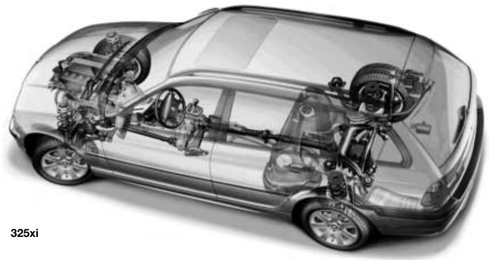

# Changes from the standard drive version are:

A specially designed body pan with a widened transmission tunnel and modifications on the driver's side to accept the transfer case.

Modified oil pan and engine mounts to provide access for the front axles.

A completely new front engine carrier.

Re-reinforcements for the front strut bearings.

A compact new transfer case (NV 124).

New transmission cross-member.

Bosch DSC III 5.7

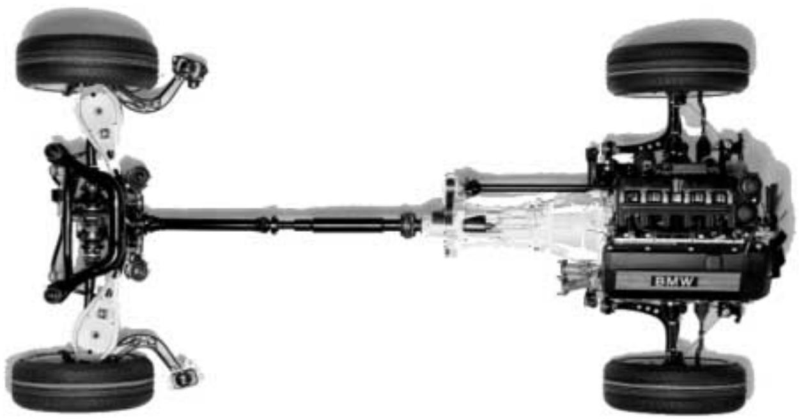

# Chassis

# Front Axle

The front axle has been completely re-designed over the standard drive E46. All components are constructed of steel.

The front axle carrier consists of two square frame sections welded to two tubes to form a box structure. The axle carrier is bolted to the vehicle frame at both the front and rear attachment points.

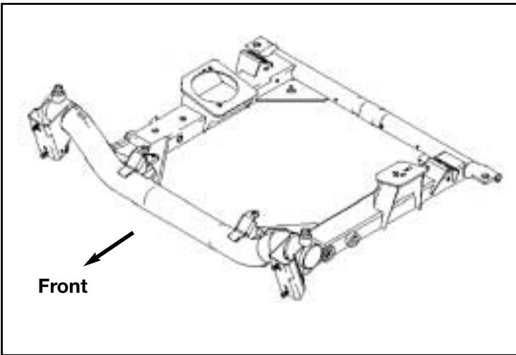

The steel lower control arms, which are smaller than the aluminum arms used on the 2wd model attach at the rear to the axle carrier.

The pivot at the apex of the lower control arms are a separate ball joint bolted to the axle carrier.

The purpose of the re-design of the lower control arms and mounting points is to provide clearance for the front axle shafts.

The hydraulic engine mounts are different from the 2wd version and have also been relocated to provide front axle clearance.

The front sway bar has been increased in diameter to 23.5mm (2wd standard: 23mm, sports suspension: $2 4 \mathsf { m m }$ to accommodate the additional weight. A sports suspension option is not available for the xi.

The struts are shorter than the 2wd and there are reinforcement plates between the strut bearing and the sheet metal of the strut towers to prevent deformation when traveling on very poor road surfaces.

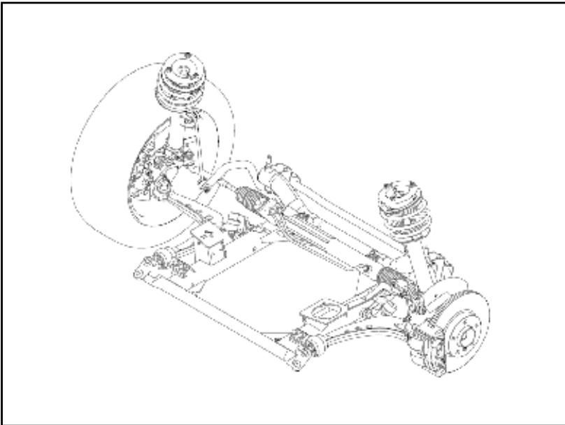

The spring travel of the E46/16 is approximately 20mm less than the 2wd version.

The shorter front axle spring travel is due to the limited angle of deflection of the front axle shafts.

# Steering

The rack and pinion steering unit has been modified from the 2wd. It is constructed with a larger diameter piston.

This is necessary to counter the additional drag of the all-wheel drive system and the wider standard wheels and tires.

The lower steering spindle is different than the 2wd and connects to the steering rack via a double cardan joint.

Turning radius of the E46/16 is 35.8ft, 1.4ft greater than the 2wd.

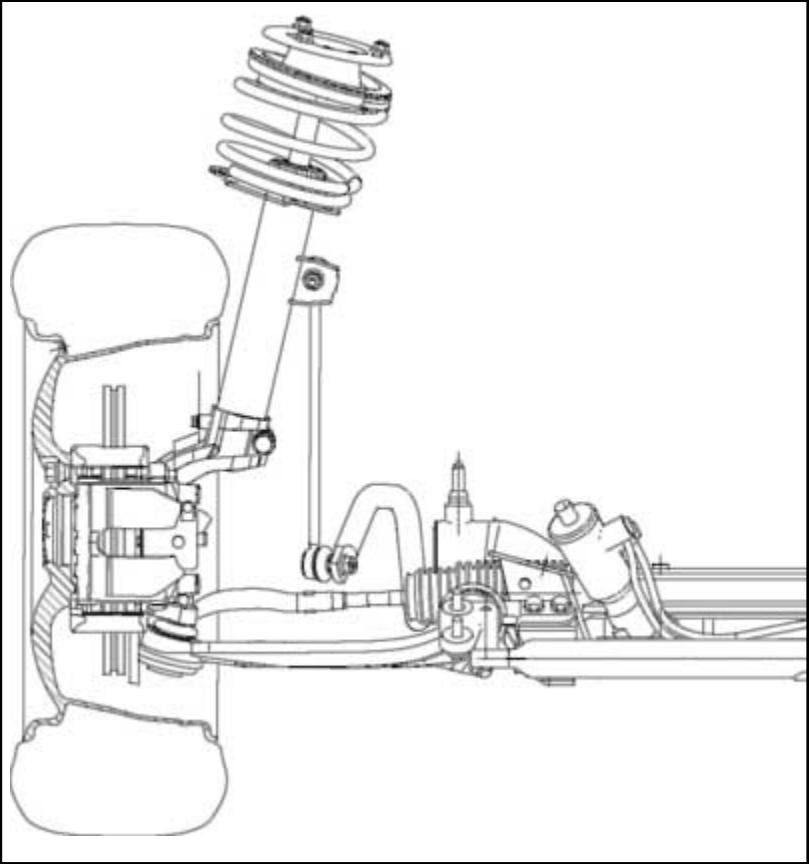

# Differential and Front Axles

The differential for the front axle is bolted to left side of the engine oil pan. The differential

is driven by a 40mm single piece drive shaft. The drive shaft has universal joints at both ends.

Type: VAG 174   
Axle ratios: 330xi 325xi Auto: 3,46:1 3,46:1 Man: 3,07:1 3,23:1   
Max torque: 2000Nm   
Weight: 40 lbs

Lifetime fluid fill: SAF-XO

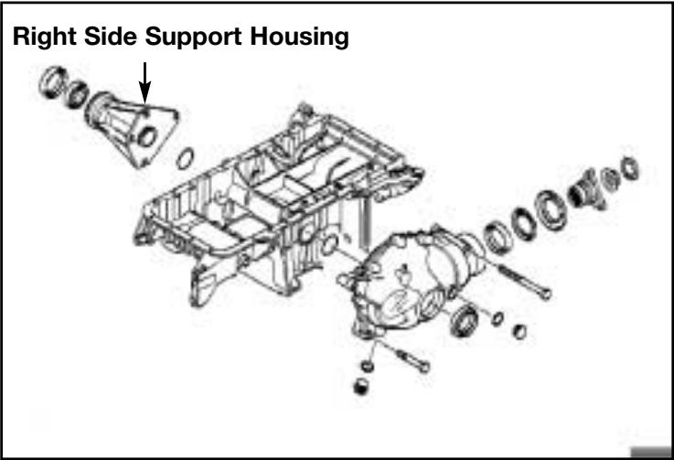

The oil sump has been modified to accommodate the right side axle. A connecting tube is welded into the oil pan. A shaft runs inside of the connecting tube between the front differential and the axle shaft on the right side.

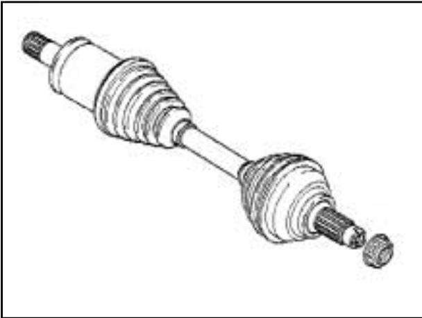

The steering knuckle is modified to accept the CV joint of the front axles. The front wheel bearings are unique to the E46/16 and incorporate the wheel speed sensor pulse wheel into the bearing seal.

Two drive shafts of equal length are used to transmit power to the front wheels.

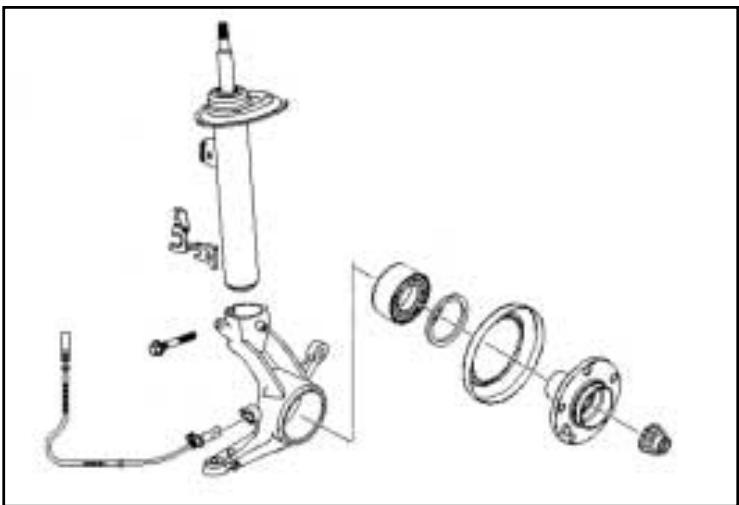

# Rear Axle

The complete rear axle and the rear differential are the same as the 2wd version of the 325i and 230i

Type: HAG 188N   
Axle ratios: 330xi 325xi Auto: 3,46:1 3,46:1 Man: 3,07:1 3,23:1   
Max torque: 3000Nm   
Weight: 84 lbs

Lifetime fluid fill: SAF-XO

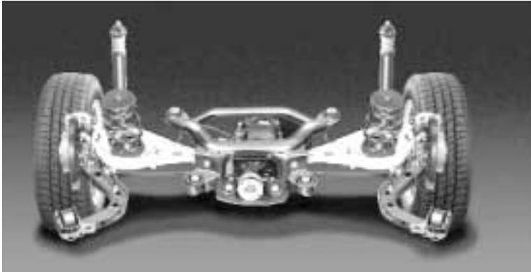

The rear spring/strut travel of the E46/16 is approximately 17mm less than the 2wd version. The reason for the reduced travel in the rear is to oppose any excessive body roll as a result of the higher body profile.

The rear sway bar has been increased in diameter to 20mm (2wd standard: 18mm, sports suspension: 19mm) to accommodate the additional weight.

# Tires and wheels

Standard wheel size is $1 7 \times 7 . 0$ to ensure there is enough room for the front axles and brakes. Tire size is 205/50 R17 All-season radials

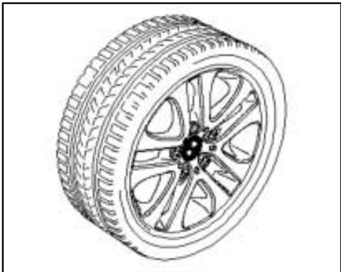  
325xi Radial Spoke 17x7.0

# Transmissions

There are two transmission variants for the 325xi and 330xi.

The manual transmission for both versions is the S5D-280Z direct gear transmission. The extension housing is modified to accept the transfer case.

The transmission has a lifetime fill of MTF-LT1 synthetic transmission fluid.

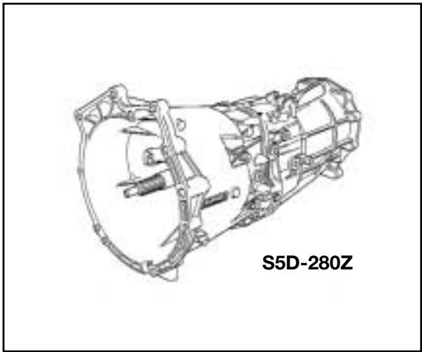

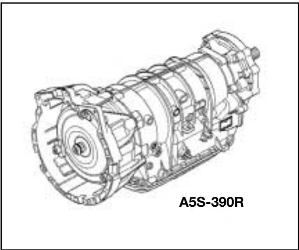

The automatic transmission for both the 330xi and $3 2 5 \times \mathrm { i }$ is the A5S-390 R (General Motors) transmission with GS 20 AGS control and Steptronic shifter.

The transmission has a lifetime fill of Texaco 8072B.

# Transmission Cross-member

Along with the lower transfer case section, the cast aluminum transmission cross-member is a low profile design to optomize ground clearance.

Both manual and automatic transmissions utilize the same part.

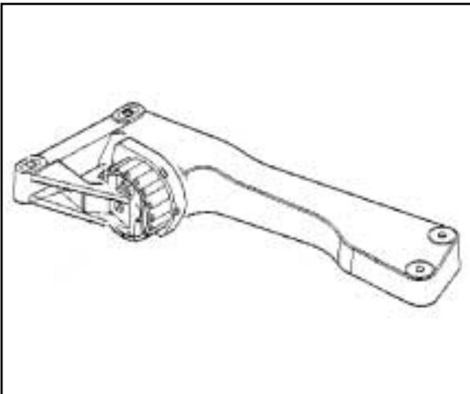

# Transfer Case

The Transfer case for the E46/16 is the NV 124 manufactured by New Venture. The primary difference between the NV 124 and the NV 125 used in the X5 SAV is that it uses gears instead of a drive chain for torque transfer to the front axle.

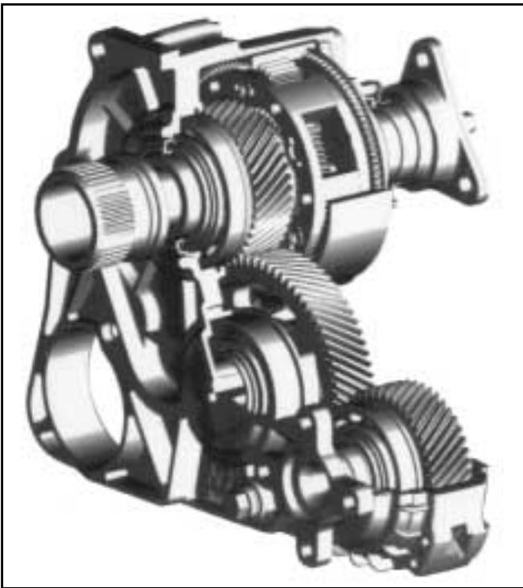

The reason gears are used is to produce a compact low profile transfer case that could fit in the transmission tunnel of an E46 without excessively limiting the forward travel of the drivers seat.

Manufacturer: New Venture Type: NV 124 Torque Distribution: $3 8 \%$ : $62 \%$ Maximum Torque: 300Nm

The transfer case is only one speed and does not use any viscous coupler.

The transmission ratio of the planetary gear set provides a fixed torque transfer of 38:62 (front:Rear). The output speeds to the front and rear axle are the same (1:1).

The input to the Planetary Carrier is from the output shaft of the transmission.

The Sun Gear of the Planetary assembly is turned by the Planetary Gears, the Sungear then provides torque to the Transfer Gear.

Output Gear Front Axle.

The Transfer Gear drives the Fr Output via gear-to-gear contact. The front axle is driven via a flange connected to the output gear.

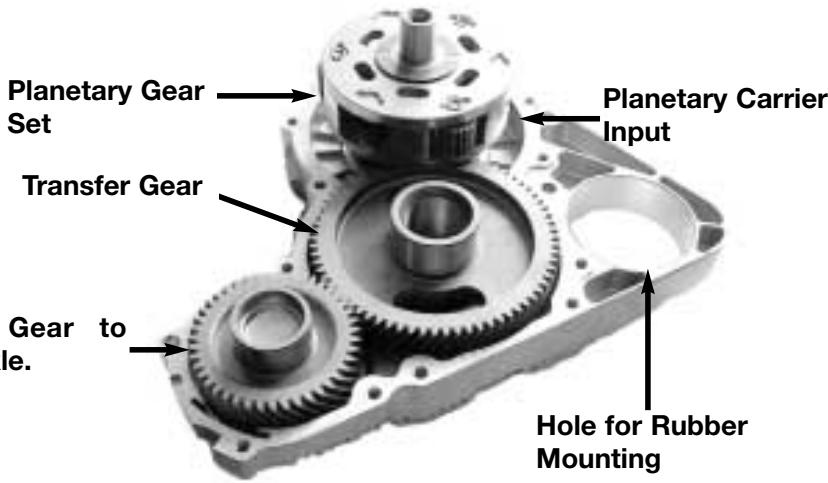

From the Ring Gear , the power is transmitted via the driveshaft to the rear axle differential.

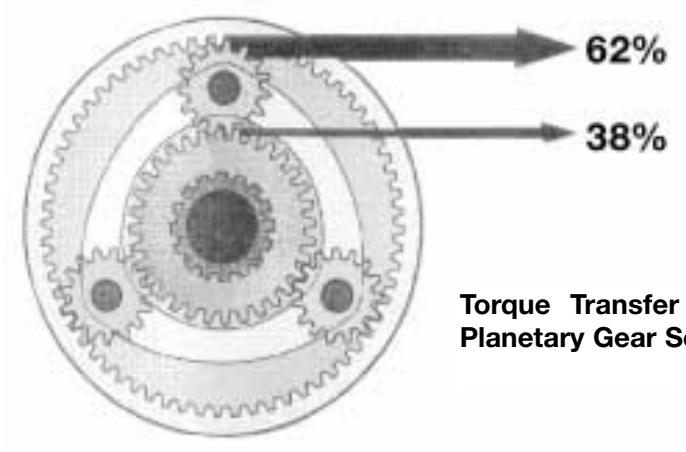  
Torque Transfer from the

The transfer case is filled with a lifetime fill of MTF-LT1 P/N 83-22-9-408-942. The only repairs possible are the replacement of the three oil seals and the hydraulic mount.

Oil Volume: 0.24 liter Drain/Fill plug torque: 33Nm

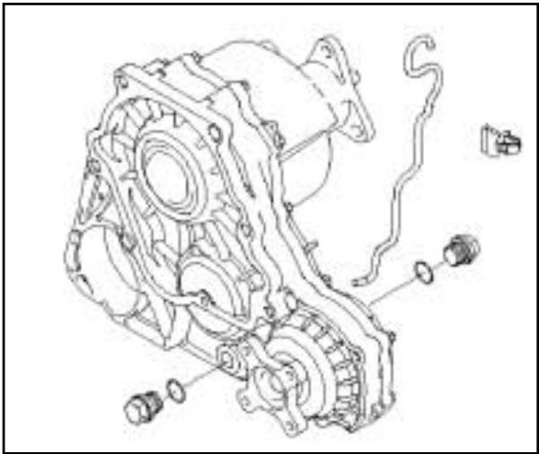

# Review Questions

How is the hood of an E46 placed into the workshop position?

2Explain the door anchoring system of the E46.

Describe the fuse locations of the E46.

4Describe the changes made to the E46 front and rear suspension from the previous 3 series (E36).

Where is the emergency release for the tailgate located on the E46 Sport Wagon?

What allows the windshield frame of the E46 Convertible to act as a rolover protection device?

7.How is the floor pan on the E46 Convertible improved for structural rigidity?

8Describe the components used in the E46 all-wheel drive running gear.

9.Describe the changes made to the front suspension of the E46 to accommodate the all-wheel drive system.