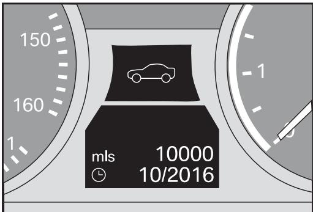
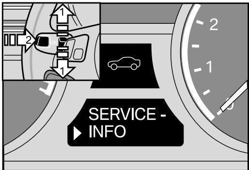
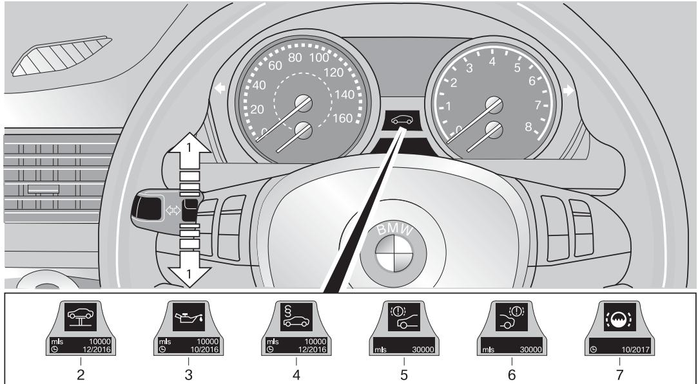
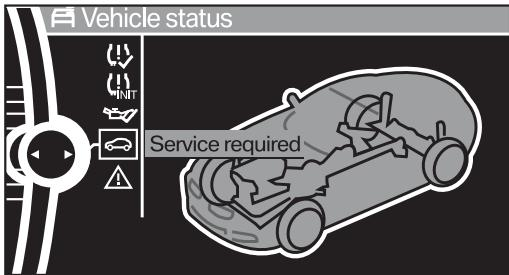
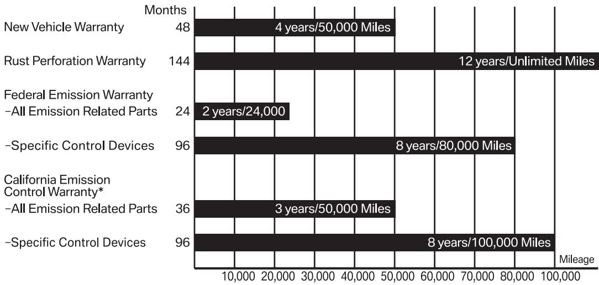

Service and Warranty Information

# Owner/Driver Information:

Name

Address

# Owner/Driver Telephones:

Business

Home

Model X1 Year_2014

Retail/In-Service Date

Trim Code_ Color Code_

Production Date_

License Plate Number

# BMW Center Telephone Numbers:

Offices Services

# Table of Contents

2014 X1 Models covered in this Booklet. . .

BMW Ultimate Service™M

The BMW Maintenance Program

Coverage 1   
Maintenance Upgrade Option 2   
Intervals 2

Condition Based Service (CBS) . . .

Service Required Display

Info Display screen contents . 3

Info Display screens in the instrument cluster .3

Possible displays 4   
Control Display screen contents (vehicles with iDrive) 5   
Symbols. 5   
Special Note  Maintenance Intervals 5   
Quality Certification I . 7   
Fuel Quality - Gasoline

# Maintenance Service Summary..

Standard operations 7   
Engine oil 7   
Maintenance services connected to a specific engine oil service\* 7   
Maintenance services that display in CBS 8   
Front brakes 8   
Rear brakes 8   
Vehicle check 8   
Brake fluid 8   
Spark plugs (connected to specific Engine Oil Service) 8

Emission Control Maintenance Schedule . . .

Battery Care . . . .

Corrosion Protection 9   
Restoring corrosion protection 10   
Underbody maintenance 10

3MW Roadside Assistance 10

BMW Roadside Assistance Smartphone Application . .10   
Owner's Eligibility .10   
Getting Started . .10   
Calling For Assistance .10

# Gervices 11

Dispatch Service 11   
On-Site Assistance .11   
Lock-Out . .11   
Towing Service. . 11   
Sign-and-Drive. .12   
Trip Interruption Benefits 12   
Car Rental Discounts 12   
Exclusions.. .12

Customer Assistance Information 13

Customer Assistance - Notification .13

BBB Auto Line 11

California Residents .16

Special Programs. . . .. 17

Overview of BMW Limited Warranties. . . . 18

# New Vehicle Limited Warranty — 2014 Models

# (Valid Only in the U.S.A. including Puerto Rico) 19

Warranty Begins .19   
Warranty Period 19   
Warranty Coverage 19   
Safety Belt Warranty - Kansas 19   
Other Items 19   
General . . .20

Limited Warranty — Rust Perforation 2014 Models . . . .. 2C

Federal Emissions System Defect Warranty (Valid Only in the U.S.A. including Puerto Rico) 21 What is not covered . 22 General . 23

# Federal Emissions Performance Warranty

(Valid Only in the U.S.A. including Puerto Rico) . . . . 23

California Emission Control Warranty Statement\* Your Warranty Rights and Obligations 25 Manufacturer's Warranty Coverage: 25 Owner's Warranty Responsibilities: 25

# California Emission Control System Limited Warranty\* .. 2€

What is not covered 27   
General .28   
California Emission Warranty Parts List 29

Notice ..3(

# Correcting, Updating or Changing Vehicle-Related or Ownership Information . . . . . 3(

Tire Warranty Statement. . .. 3C

# 2014 X1 Models covered in this Booklet

X1 sDrive28i X1 xDrive28i X1 xDrive35i

# BMW Ultimate Service™M

BMW Ultimate Service leads the industry in providing owners with incredible value and peace of mind. This service includes:

$\triangleright$ The BMW Maintenance Program: No cost factory-recommended maintenance for 4 years/50,000 miles from the original in-service date, whichever comes first.

$\triangleright$ BMW Roadside Assistance: No-cost 24/7 on-the-road assistance for 4 years/unlimited miles from the original in-service date. Also includes trip-interruption benefits as well as trip routing services.

$\triangleright$ New Vehicle Limited Warranty: Limited coverage for defects in materials and workmanship for 4 years/50,000 miles from the original in-service date, whichever comes first. Repairs will only be made at authorized BMW centers using Original BMW Parts.

# The BMW Maintenance Program

The BMW Maintenance Program is a benefit designed to help reduce the cost of ownership. This program has been devised with the following objectives: to maximize vehicle safety, reliability, and resale value by minimizing breakdowns resulting from wear, and minimizing cost and inconvenience by computing maintenance intervals based upon the specific manner in which each individual vehicle is driven.

A 2014 X1 vehicle purchased from an authorized BMW center in the United States (including Puerto Rico) is covered by the BMW Maintenance Program for 48 months or 50,000 miles, whichever occurs first. Coverage begins on the date of first retail sale or the date the vehicle is first placed into service as a sales demonstrator, Aftersales Mobility Program (AMP) Vehicle or BMiW Group company vehicle, whichever is earlier.

Any authorized BMW center in the United States (including Puerto Rico) will perform the scheduled and/or additional maintenance services on your vehicle at no expense to you so long as your vehicle qualifies for coverage under the BMW Maintenance Program.

# Coverage

The BMW Maintenance Program covers all factory recommended maintenance, as determined by the Condition Based Service (CBS) system. Additional specific items that need replacement due to normal wear and tear, and that are not covered by the original New Vehicle Limited Warranty - such as brake pads, brake rotors, and wiper blade inserts - are included, provided wear and tear exceeds BMW wear limits. Any applicable adjustments required due to normal operating conditions are also included. See pages 7-8 of this booklet for additional information.

Exclusions from coverage include the following:

$\triangleright$ Items reimbursable under your New Vehicle Limited Warranty   
$\triangleright$ Gasoline   
$\triangleright$ Gasoline additive   
$\triangleright$ Windshield washer additive (except when in conjunction with scheduled maintenance)   
$\triangleright$ Tires, wheel alignment, tire balance and rotation   
$\triangleright$ Parking brake shoes/linings   
$\triangleright$ Reset Tire Pressure Monitor   
$\triangleright$ Wear and tear of soft trim items, such as: seats, carpets, moldings, headliner, door panels and all chrome trim   
$\triangleright$ Damage, including consequential, which results from negligence, improper operation of the vehicle, wear and tear or deterioration due to driving habits or conditions, improper repair, environmental influences, flood, accident or fire damage, road salt corrosion, alteration, installation of non-genuine BMW accessories, or use of improper, poor quality or contaminated fuel   
$\triangleright$ Altered or unreadable Vehicle Identification Number (VIN) or odometer irregularities or vehicles where the true mileage cannot be determined   
$\triangleright$ Maintenance or repair after the vehicle is deemed a total loss   
$\triangleright$ Maintenance or repairs performed by other than an authorized BMW center within the United States (including Puerto Rico)   
$\triangleright$ "Topping off" low fluids (e.g., engine oil, antifreeze, washer fluid, etc.) except when done in conjunction with a scheduled maintenance or other required maintenance work (as outlined in the customized maintenance checklist printout) that is performed during an applicable Maintenance Program period   
$\triangleright$ Vehicles used in competitive events   
$\triangleright$ Oil changes performed outside the recommended maintenance intervals as indicated by the Condition Based Service

# Maintenance Upgrade Option

Please contact your authorized BMW center for information regarding the purchase of optional Maintenance Program Upgrades. Eligibility and coverage exclusions may apply.

# Intervals

Time intervals should be followed using the maintenance intervals as indicated by the BMW Condition Based Service.

Maintenance intervals on motor vehicles have conventionally been specified based upon accumulated mileage. However, driving conditions have a major influence on routine maintenance requirements; distance traveled is only one of the significant factors. A vehicle driven for 50,000 miles of short trips in the city with numerous cold starts, prolonged periods of idling, stop-and-go driving, and high engine speeds during acceleration requires more frequent maintenance intervals than a vehicle driven for 50,000 miles for long distances at low engine speeds primarily at operating temperature.

The advanced technologies at BMW have led to the development of the unique BMW Condition Based Service (CBS) system which computes the actual optimum maintenance requirements based not only upon the accumulated mileage, but taking into account important factors such as high or low engine speeds, short or long trip driving.

# Condition Based Service (CBS)

CBS is a further development of the Service Interval Indicator System.

The remaining times for selected maintenance tasks as well as any legally prescribed dates are displayed to you individually:

$\triangleright$ Engine oil   
$\triangleright$ Brakes - front and rear separately   
$\triangleright$ Brake fluid   
$\triangleright$ Vehicle check   
$\triangleright$ Required State Inspection(s)

CBS thus determines the current and future maintenance requirements. This data can also be read from the vehicle key by your BMW Service Advisor and used to propose the optimum scope of maintenance.

Disconnecting the battery during periods of long-term storage will interrupt the calculation of time-based services. BMW recommends that you have all items requiring time-based maintenance, such as brake fluid and possibly also the engine oil and microfilter, brought up to date by your authorized BMW center. Also see the section on battery care on page 9 of this Booklet.

# Service Required Display

Info Display screen contents

The distance remaining until your next service briefly appears when you switch on the ignition.

The Info Display immediately switches to its compute mode when you press one of the two buttons on the turn signal indicator lever.

For certain maintenance operations, you can view the respective distance remaining or due date individually in the instrument cluster or in the Control Display (with optional iDrive; see page 5).

# Info Display screens in the instrument cluster

Push button 1 on the turn indicator lever up or down repeatedly until the appropriate symbol appears in the display, accompanied by the words "SERVICE-INFO".

2. Press button 2.

3. Use button 1 to scroll through the individual service items.

# Possible displays

Button for selecting functions

2. Service requirements

3. Engine oil

4. State required safety inspection\*

5. Front brake pads

Rear brake pads

7. Brake fluid

\*Note: The display icons for the state required safety and emissions inspection may be deactivated by your authorized BMW center if the state in which your BMW is registered does not require them.

The sequence of displayed service items may vary. The data for the next service appointment is showr first.

# Control Display screen contents (vehicles with iDrive)

The current Status of Service items determined by the CBS are shown in the Control Display.

You can also view additional information on the service and maintenance requirements.

1 Open the start menu.

Press the controller to open the i-menu.

3. Select "vehicle info" and press the controller.

4. Select "vehicle status" and press the controller.

A list of selected maintenance operations and, if applicable, inspections required by law is displayed.

You can request more detailed information on every entry.

Select the entry and press the controller.

# Symbols

No service is currently required.

The deadline for service or a state inspection is approaching. Please contact your authorized BMW center for an appointment.

The service deadline has already passed.

Service required 9:43 am oK Engine oil ok Brake fluid oK § Vehicle inspection + ok Vehicle check ok Front brake pads oK Rear brake pads

You can request more detailed information on every entry.

Turn the controller to scroll through the list, then confirm the selected entry.

Confirm to exit the list.

The current service status is automatically saved in the vehicle's key. The Service Advisor at your authorized BMW center has a device called a key reader. When your Service Advisor inserts your key into the key reader, all pertinent vehicle and servicing data will be available, and a customized maintenance checklist is printed out based on the specific operations called for by the Condition Based Service.

Service requirement details C Date: 05/2016 § Vehicle inspection Next state inspection due soon

To exit from the menu:

Select the arrow and press the controller.

# Special Note  Maintenance Intervals

The maintenance requirements for your vehicle are determined dynamically by the Condition Based Service (CBS) system. The maintenance items stated herein reflect the latest information available at the time of the printing of this Booklet, and are subject to change.

2014 X1 vehicles built prior to July 2013 utilized a different CBS "connected service item" interval as detailed on page 9.

The completion of certain subsequent maintenance items or services, as required to properly maintain your vehicle, will be specified at intervals computed by the BMW Condition Based Service system as follows:

$\triangleright$ Oil Service: Engine oil should be changed with the engine at operating temperature.

All 2014 model year X1 vehicles are factory-filled with BMW High Performance Synthetic oils. We recommend BMW High Performance 5W-30 Synthetic Oil (BMW part number 07 51 0 017 866) for regular scheduled engine oil changes.

BMW recommends that you check your engine oil level whenever you add fuel to your vehicle. For information on checking your engine oil level, refer to your vehicle's Owner's Manual.

If you need to add oil between oil changes and BMW High Performance Synthetic Oil is unavailable, for the purpose of topping up the engine oil level only, BMW recommends use of one of the below-listed synthetic oils:

The synthetic oils listed below meet BMW's   
Long-life rating LL01 (API rating SL):   
$\triangleright$ Castrol Syntec European Formula SAE OW-30   
$\triangleright$ Mobil 1 SAE 0W-40   
$\triangleright$ Pennzoil Platinum European Formula Ultra SAE 5W-30   
$\triangleright$ Valvoline SynPower SAE 5W-30

The choice of the right SAE grade is based on the climatic conditions in the region in which you normally drive your BMW. To best determine which SAE grade is best suited for your vehicle, contact an authorized BMW center.

If you are unable to obtain a recommended synthetic oil from the list above, for the purpose of topping up the engine oil level only, use only a synthetic oil with an API rating of SM or higher.

The following maintenance services: - Brake Fluid Service; - Intake Air Cleaner Service;

- Oxygen Sensor Service; - Spark Plug Service; - Ventilation Microfilter Service, must be performed when required as indicated by the following as applicable:

$\triangleright$ The specified CBS engine oil service counter interval   
$\triangleright$ The time interval (the first occurrence based on the vehicle's production date)   
$\triangleright$ The stated mileage for a "non-connected" maintenance service

Refer to pages 7 - 9 for additional information.

Additionally,

- The engine coolant has a long-term rating and does not need to be changed except for system repairs.

The automatic transmission installed in the BMWs covered in this publication contain transmission oil with a long-term rating. The oil does not need to be changed except for repairs.

For your convenience, you may also wish to have your authorized BMW center perform any necessary operations to fulfill any state inspection requirements in your area, concurrent with the maintenance services specified above during other repairs. Should you request more frequent maintenance service, the cost of these services will not be covered by the Maintenance Program.

BMW has applied the most modern technological advances not only to the design and production of your vehicle, but also to computing of the optimum maintenance interval for your type of operations and driving style. Your authorized BMW center has made a substantial investment in unique BMW special service tools to enable BMW factory trained service technicians to perform quality repairs on your BMW in minimal time, to help maximize your satisfaction with your BMW, its longevity, and resale value.

# Quality Certification I

# Quality Certification I

Performed by (selling BMW center/Stamp with Code)

# FREE OF CHARGE

Date Mileage

Authorized Signature of Service Manager

For a detailed list of items inspected, refer to the Quality Certification I form provided to the Owner at time of delivery. A copy of the form is on file at the selling authorized BMW center.

# Fuel Quality - Gasoline

Only use fuels advertised to have adequate detergency and low alcohol (such as ethanol) content. Please refer to your owner's manual for important information on the fuel recommended for use in your vehicle. Use of fuels with insufficient detergent and/or excess alcohol can cause driveability problems that necessitate cleaning intake valves and fuel injection valves, and, when applicable, adjusting the engine idle. We suggest having this work performed by your authorized BMW center, perhaps while regular maintenance is performed. Your authorized BMW center can also recommend a gasoline additive that will provide sufficient detergency. This recommended unscheduled maintenance which may be necessitated by use of inappropriate fuels is not required in order to maintain the emission warranty. It also is not covered by your vehicle's warranty because no defect in material or workmanship or component failure is involved.

# Maintenance Service Summary

The Condition Based Service (CBS) system will determine the requirement for performing the maintenance services described in this section, ending on page 8. These services may be required either individually or in conjunction with other maintenance services.

Maintenance services are performed as outlined in this section, based on intervals of either time, mileage or after performing a specified number of previous services. These intervals correspond to the latest information available when this Booklet was printed. Maintenance intervals are subject to change with newer vehicles or may also apply retroactively. Your authorized BMW center will be able to advise and perform maintenance services as required by the most recent information that applies to your vehicle.

The maintenance services "connected to a specific CBS engine oil service," as outlined below, apply to vehicles built as of July 2013.

X1 vehicles built prior to July 2013 utilized a different CBS "connected service item" interval as detailed on page 9.

# Standard operations

Maintenance work:

$\triangleright$ Verify Check Control messages.

$\triangleright$ Check indicator and warning lights.

$\triangleright$ Reset CBS display.

$\triangleright$ Inspect tires, adjust tire pressures and reset Tire Pressure Monitor.

$\triangleright$ Check parking brake functionality while the vehicle is being driven into the workshop.

# Engine oil

Maintenance work:

$\triangleright$ Change the engine oil and oil filter (as shown in CBS). We recommend BMW High Performance 5W-30 Synthetic Oil P/N 07 51 0 017 866.

# Maintenance services connected to a specific engine oil service\*

\*These additional connected services will not be shown in the vehicle's CBS display.

Maintenance work:

$\triangleright$ After every 2nd Engine Oil Service: Ventilation microfilter: replace ventilation microfilter. $\triangleright$ At every 5th Engine Oil Service: Intake air cleaner: replace air filter element (reduce replacement interval in dusty operating conditions).

# Maintenance services that display in CBS

# Front brakes

Maintenance work:

$\triangleright$ Replace brake pads, clean brake pad contact points in calipers.   
$\triangleright$ Brake discs: Check surface and thickness, replace as necessary.

# Rear brakes

Maintenance work:

$\triangleright$ Replace brake pads, clean brake pad contact points in calipers.   
$\triangleright$ Brake discs: Check surface and thickness, replace as necessary.   
$\triangleright$ Parking brake: Check function. Repair or replace parking brake shoes/linings only if a reduction in the brake's effectiveness is noted. When fitted, parking brake shoes/linings are excluded from coverage under the BMW Maintenance Program.

# Vehicle check

Maintenance work:

$\triangleright$ Check operation of horn, headlight flasher and hazard warning flashers.   
$\triangleright$ Check instrument and control lighting and heater/air-conditioning blower.   
$\triangleright$ Check lighting system: Turn signals, back-up, license plate, interior (incl. map, reading lights), glovebox, luggage area lights.   
$\triangleright$ Safety belts: Check condition and function.   
$\triangleright$ Check windshield and tailgate wipers and washer jet positions.   
$\triangleright$ Tires: Check tread depth, wear pattern, outer condition, inflation pressure. If necessary, correct pressure.

$\triangleright$ Reset Tire Pressure Monitor.

$\triangleright$ Battery: Check state of charge (magic eye) and charge if required.

$\triangleright$ Power steering reservoir: Check fluid level.

$\triangleright$ Visually inspect all SRS airbag units for torn covers, obvious damage or attachment of stickers.

$\triangleright$ Rear-view mirrors.

$\triangleright$ Coolant: Check fluid level and concentration.

$\triangleright$ Windshield washer and intensive cleaning systems: Check protection level, fluid level; top up if necessary.

$\triangleright$ Brake system connections and lines: Check for leaks, damage and correct positioning.

$\triangleright$ Underbody, incl. all visible parts (i.e. transmission, rear axle, fuel lines, exhaust system): Check for damage, leaks and corrosion.

$\triangleright$ Steering components: Check for clearance, leaks, damage and wear.

$\triangleright$ Final Inspection: Road test with check of:

- Brakes   
- Steering   
- Shock absorbers (visual)   
- Transmission

# Brake fluid

Maintenance work: $\triangleright$ Replace brake fluid.

# Spark plugs (connected to specific Engine Oil Service)

Maintenance work: $\triangleright$ Replace at every 6th Engine Oil Service (approximately 60,000 miles).

# Emission Control Maintenance Schedule

The maintenance schedule as shown is required for the proper functioning of the emission control systems for optimum vehicle performance and fuel economy.

# Basic Engine

Engine oil As specified by CBS Engine oil filter As specified by CBS

# Connected maintenance services items intervals for 2014 vehicles built as of July 2013:

# Fuel System

Air filter

Replace at every 5th Engine Oil Service

Ignition System Spark plugs

At every 6th Engine Oil Service (approximately 60,000 miles

# Emission Control Components

Oxygen sensor

120,000 miles   
150,000 miles

Oxygen sensor (if eligible for the California Emissions Warranty)

Oxygen Sensor Service: The oxygen sensor deteriorates strictly on a mileage basis and must therefore be replaced to maximize vehicle fuel economy and minimize exhaust pollution.

# Connected maintenance services items intervals for 2014 X1 vehicles built prior to July 2013:

# Fuel System

Air filter

Replace at every 3rd Engine Oil Service

Ventilation microfilter

At every brake fluid service

Ignition System Spark plugs

At every 4th Engine Oil Service

Vehicle Vehicle check

At every 2nd Engine Oil Service

# Battery Care

If your vehicle is driven only for short distances of less than 10 miles over a prolonged period of time, without an occasional drive at highway speeds, the engine's charging system will not maintain the battery. Insufficient use of the vehicle could result in short term starting problems and, in the long term, could damage the battery.

In case the vehicle is not operated for several weeks, it is advisable to:

$\triangleright$ consider using a proper trickle charger, following the charger manufacturer's instructions, to maintain the battery's state of charge; or $\triangleright$ consult your authorized BMW center regarding battery removal. Once removed, the battery must be charged and stored in a cool, dry place where it can be protected from freezing. If the battery will be stored for over 3 months, it must be recharged every 3 months, or else it will become damaged and useless.

Please consult with your authorized BMW center for further guidance and information.

# Corrosion Protection

Extensive corrosion protection measures implemented by BMW now make it possible to offer a 12-year unlimited mileage anti-corrosion warranty against rust perforation on your vehicle provided that the vehicle is properly maintained. Information on proper maintenance is available in this Booklet and your vehicle's Owner's Manual.

The major degree of corrosion protection is due to the electrophoretic dip painting process which cathodically deposits paint particles on all body parts, attracting paint particles into the minutest cavities or seams. Body parts are designed to provide optimum corrosion protection.

During manufacture, metal exterior body parts receive an additional corrosion protection coat. Hood, trunk, doors and other body parts are coated with PVC and sealed from the outside.

All floor panels receive a resilient coating of PVC for maximum protection against damage due to stones, etc.

Corrosion protection materials tested over many years are applied to the surfaces of cavities and to the entire underside of the vehicle during and after assembly.

For additional information on the 12-year unlimited mileage anti-corrosion warranty see the Warranty Section of this Booklet (page 20).

# Restoring corrosion protection

Please take care that anti-corrosion material is replaced when your vehicle is repaired after body or chassis damage.

BMW will not accept any liability for repair of, or damage caused by, any parts and accessories not approved by BMW.

# Underbody maintenance

The underbody has to be cleaned at least once a year, in Spring, with plain water in order to remove mud, chemical sediments and other deposits. If those materials are not removed, corrosion (rust) will occur on metal components.

Your authorized BMW center can do this anti-corrosion service for you.

Do not apply additional undercoating or rust-proofing on or near the exhaust   
manifold, exhaust pipes, catalytic converter or heat   
shields. During driving, the substance used for   
undercoating could overheat and cause a fire.

# BMW Roadside Assistance

# The BMW Roadside Assistance Program reflects BMW's commitment to your complete satisfaction with the BMW ownership experience.

It's available for U.S. version BMWs in all 50 states, Canada, and Puerto Rico 24 hours a day, 365 days a year.

It's a valuable benefit provided to you at no additional cost. (Subject to certain limitations and exclusions noted on page 12).

The BMW Roadside Assistance Program is not a warranty and does not affect your rights under the New Vehicle Limited Warranty.

Services provided by a third-party business partner.

# BMW Roadside Assistance Smartphone Application

The free BMW Roadside Assistance Smartphone App dispatches fast, reliable service to your BMW. For more details and to download the App for your iPhone $\textcircled{8}$ , BlackBerry $\circled{8}$ , Android™ or Windows Mobile® Smartphone, visit http://roadsidemobile.com/bmw

# Owner's Eligibility

You are covered if your vehicle is:

$\triangleright$ A new BMW automobile, distributed by BMW NA, and purchased at an authorized BMW center, OR; $\triangleright$ A new BMW automobile, purchased under the BMW NA European Delivery Plan, OR; $\triangleright$ A new, U.S. version, BMW automobile purchased under the Diplomatic or Military Sales programs, operated in any of the 50 states, Canada and Puerto Rico.

The vehicle itself is covered when driven by any authorized driver.

Protection:

New BMWs — Protection is provided for 4 years/unlimited miles. NOTE: This does not affect warranty coverage which remains at 4 years/50,000 miles. Certified Pre-Owned BMWs — 6 years/unlimited miles from the original in-service date.

# Getting Started

For your convenience, a decal showing Roadside Assistance information has been affixed on the driver's side of the windshield and in the rear compartment area.

# Calling For Assistance

The toll-free BMW Roadside Assistance number (1 800 332-4269) is answered by a BMW Roadside Assistance service representative. In order for you to receive quick and reliable services, it is essential that you provide detailed and accurate information to the service representative.

Be prepared to give:

$\triangleright$ Your name.   
$\triangleright$ Your complete Vehicle Identification Number (found on your vehicle registration, or on the bottom driver's side of your windshield).   
$\triangleright$ Model description of your vehicle.   
$\triangleright$ License plate number of your vehicle.   
$\triangleright$ Vehicle location (including nearby crossroads/ intersections, highway mile markers, street numbers, landmarks, etc.)   
$\triangleright$ Location you are calling from (including a telephone number where you can be reached). If you are calling from a public phone, wait there for the return call. Do not leave this location without informing the Roadside Assistance service representative.   
$\triangleright$ A description of your vehicle's problem. Specific and accurate information will enable the Roadside Assistance service representative to provide the proper help.

Note: If you are using the free BMW Roadside Assistance Smartphone App, the information above is not required.

Emergency Valet Service. Should there be a need beyond BMW Roadside Assistance, Emergency Valet service will provide a personal assistant who will help in every way to get you to your final destination. Emergency Valet service will help you locate a rental car or taxi agency, hotel or even help procure airline reservations. In the event of an emergency, this service will assist you in getting information out to the proper party, whether it is business or personal. If we are unable to contact one of your party, the message relay service will document the information, and will make reasonable efforts to deliver the message to the message recipient.

Personal Trip Routing. Leave the planning to us. Simply give one of our Roadside Assistance service representatives a call, and we will provide you with a detailed, easy to read, computerized trip itinerary and companion map package. Please allow up to two weeks to process your request.

# Services

From the information you provide, the BMW Roadside Assistance service representative wil determine the type of help required.

# Dispatch Service

A service provider will be dispatched to the site of your disabled vehicle.

# On-Site Assistance

On-site service for vehicle disablements such as flat tires, dead batteries, and out of fuel conditions is provided up to a maximum of $\$ 100.00$ per incident by BMW Roadside Assistance.

The cost for parts and fuel, when used on-site, are the responsibility of the owner/driver. The New Vehicle Limited Warranty does not cover any of the above on-site services.

# Lock-Out

Your BMW is equipped with an advanced entry system, which cannot be bypassed by traditional locksmith methods without significant damage to your vehicle. However, in the event that you find yourself locked out, a simple telephone call to Roadside Assistance will help you get back on the road. A representative will help you find transportation or arrange towing service to the nearest authorized BMW center. Related towing costs will be compensated up to $\$ 100.00$ per incident. You, or the person driving your vehicle, are responsible for any expenses related to replacement keys.

# Towing Service

In the event of a mechanical breakdown normally covered under the New Vehicle Limited Warranty, your vehicle will be transported (at no cost) to the nearest authorized BMW center. Your vehicle is also covered in the event of an accident or collision.

If a breakdown occurs after normal business hours, your vehicle will be transported to a secure location and transported to the nearest authorized BMW center on the next business day.

If you request that the vehicle be taken to a location other than the nearest authorized BMW center, any additional expense will be your responsibility.

However, you may request (at no cost) to be taken to a different authorized BMW center as long as it is within 50 additional miles of the "nearest" authorized BMW center.

Towing requests for vehicles disabled because of casualty, fire, act of God, or violation of law (federal, state or local) are provided at the expense of the owner/driver.

If it is necessary for you to have your vehicle towed through your own arrangements, you must contact BMW Roadside Assistance for prior authorization and instructions on claim procedures. All claims must be submitted within sixty (60) days of the disablement or occurrence, accompanied by the original receipts. Claims received after that time period may be dishonored and are subject to the full discretion of BMW Roadside Assistance. If BMW Roadside Assistance is not contacted for "prior" authorization, the maximum coverage for towing is $\$ 100.00$ .

# Sign-and-Drive

Typically, if you are within the terms of your warranty, the services you receive under the BMW Roadside Assistance program will not require payment. In most cases, you will simply sign a receipt from the provider of services.

# Trip Interruption Benefits

Trip interruption benefits are provided for mechanical breakdowns as follows:

$\triangleright$ Breakdowns that are warranty related, and; $\triangleright$ Must occur in excess of 100 miles from the driver's primary residence, and; $\triangleright$ Repairs cannot be completed during normal business hours on the same day of breakdown.

Reimbursements wllbe made for meals, lodging, car rentals, and alternate transportation to bring the driver and the BMW automobile together after the vehicle has been repaired by an authorized BMW center. Original receipts must accompany all reimbursement requests.

Trip interruption coverage is limited to $\$ 1,000.00$ per incident, for a maximum of five days per incident.

Always contact BMW Roadside Assistance for trip interruption benefits. They will assist in making all the necessary arrangements.

# Car Rental Discounts

Discounts are available from several car rental companies. Benefits may vary with each company and location, and are subject to change without notice.

Simply use the following information to receive your discount:

Avis: Discount Code: B769775 1 800 331-1212

Budget: Discount Code: T464331 1 800 527-0700

Enterprise®: Discount Code: NA24109 1 800 RENT-A-CAR

Hertz $\circled{8}$ .   
Discount Code: CDP#1646338 1 888 204-0234

# Exclusions

Specifically excluded from coverage are:

$\triangleright$ Fines, taxes, or impound towing fees caused by a violation of local or state law. $\triangleright$ Expenses related to extreme adverse weather conditions, including, but not limited to, floods, hurricanes and tornadoes (removal from water, snow, ice, etc.). $\triangleright$ Expenses for the removal of snow tires and mounting or removal of snow chains.

# Customer Assistance Information

Your satisfaction with our product and the services provided by authorized BMW centers is of great importance to us. We take pride in our product, as does the authorized BMW center who services it. If you should ever have a question regarding your authorized BMW center's service or your BMW's performance, we recommend that you contact your authorized BMW center.

When contacting an authorized BMW center, we suggest that, depending upon the nature of your contact, you discuss it with either the Sales, Service, or Parts Manager.

As all matters are resolved at the authorized BMW center level, it is important that they be given the opportunity to provide a solution. Should you feel that you were not provided with the proper response, we urge you to contact the General Manager or authorized BMW Center Operator.

Despite the best intentions of all parties, a misunderstanding may occur between you and your authorized BMW center. Should this occur and you require further assistance, please contact the BMW NA Customer Relations and Services Department at:

Telephone: 1 800 831-1117

Email: customerrelations@bmwusa.com

Website: www.bmwusa.com

When contacting us, we ask that you provide the following information:

$\triangleright$ Your name, address and telephone number   
$\triangleright$ Vehicle Identification Number (last seven digits)   
$\triangleright$ Vehicle delivery date   
$\triangleright$ Vehicle mileage   
$\triangleright$ Selling authorized BMW center's name   
$\triangleright$ Servicing authorized BMW center's name   
$\triangleright$ Description of the problem

A BMW NA Customer Relations and Services Representative will carefully review all the facts involved and let you know what further action will be taken in conjunction with your authorized

BMW center. Please remember: the first step in resolving a complaint is to contact the authorized BMW center that performed the work on your vehicle. They have the necessary equipment and the personnel to achieve this goal.

We are confident that every effort will be made to ensure your satisfaction.

# Customer Assistance - Notification

During a specific period (for example, the earlier of 12 months or 12,000 miles, though this period varies by state), some states require us or our authorized BMW center, to repair in a reasonable number of attempts, any defect or condition which substantially impairs the use, value, or safety of a new vehicle sold, leased or registered in that state.

A reasonable number of attempts is generally defined as (i) four or more attempts to repair the same defect (the number of attempts vary by state) or (i) the vehicle is out of service by reason of one or more repair(s) for more than a cumulative total of 30 days (this period varies by state), except for delays created by conditions beyond our control.

If we are unable to correct a defect or condition covered by these statutes in a reasonable number of attempts, we may be obligated either to replace the vehicle or reimburse the owner/ lessee in an amount equal to the purchase price or lease payments paid by the owner/lessee, less the amount directly attributable to use of the vehicle by the owner/lessee.

You should send written notification directly to BMW of North America, LLC of the existence of an alleged defect. Send written communication to the Customer Relations and Services Department address listed below.

BMW of North America, LLC   
Customer Relations and Services Department   
P.O. Box 1227   
Westwood, NJ 07675-1227   
Telephone: 1 800 831-1117   
Email: customerrelations@bmwusa.com

IMPORTANT: IF THIS VEHICLE HAS A DEFECT THAT SUBSTANTIALLY AFFECTS ITS USE, VALUE OR SECURITY, OR THAT MAY CAUSE DEATH OR SERIOUS BODILY INJURY IF DRIVEN, AND WAS PURCHASED, LEASED OR REGISTERED IN NEW JERSEY, YÓU MAY HAVE THE RIGHT UNDER THE LEMÓN LAW IN THE STATE OF NEW JERSEY TO A REFUND OF THE PRICE OF PURCHASE OR TO YOUR LEASE PAYMENTS.

Here is a summary of your rights:

1. To qualify for compensation under the New Jersey lemon law, you must give the manufacturer or your dealer opportunity to repair or correct the defect of the vehicle within the terms of protection under the lemon law, which are the first 24,000 miles of operation or two years after the date of original date of delivery or whichever comes first.

2 If the manufacturer or your dealer cannot fix or correct the defect within a reasonable amount time, you may have the right to return the vehicle and receive a full refund, less a discount for the use of the vehicle.

If it is assumed that the manufacturer or your dealer cannot repair or correct the defect and if the same defect continues to substantially exist after that the manufacturer has received a notice of the defect, sent by certified mail with return receipt, and has had a final chance to correct the defect or condition within 10 days of receiving the notice. This notice must be received by the manufacturer within the terms of protection and can only be given after (i) the manufacturer or your dealer has attempted two or more times to correct the defect; (i) the manufacturer or your dealer has attempted, at least once, to correct the defect if the defect is one which can cause death or serious bodily injury if the vehicle is operated; or (i) the vehicle has been out of service for repairs by a total of 20 calendar days accumulation or more, or in the case of a rolling motorized house (motorhome) 45 days or more.

4. If the same defect substantially continues to exist after the manufacturer has had the last opportunity to repair or correct the defect, you may file a claim for compensation under the New Jersey lemon law.

FOR COMPLETE INFORMATION ABOUT YOUR RIGHTS AND RESOURCES UNDER THIS LAW, INCLUDING THE MANUFACTURER'S ADDRESS FOR NOTIFICATION OF THE DEFECT, PLEASE CONTACT: NEW JERSEY DEPARTMENT OF LAW AND PUBLIC SAFETY, DIVISION OF CONSUMER AFFAIRS, LEMON LAW UNIT, POST OFFICE BOX 45026, NEWARK, NEW JERSEY 07101, PHONE NUMBER: 1 973 504-6226

IMPORTANTE: SI EL VEHÍCULO TIENE UN DEFECTO QUE AFECTE DE MANERA   
SUSTANCIAL SU USO, VALOR O SEGURIDAD, O QUE PUEDA CAUSAR LA MUERTE O   
LESIONES CORPORALES GRAVES SI SE   
MANEJA, Y SE COMPRÓ, ARRENDÓ O   
REGISTRÓ EN NUEVA JÉRSEY, PUEDE TENER DERECHO EN LOS TÉRMINOS DE LA LEY SOBRE DEFECTOS CONOCIDA COMO   
"LEMON LAW" DEL ESTADO DE NUEVA   
JERSEY A UN REEMBOLSO DEL PRECIO DE COMPRA O DEL PAGO DEL   
ARRENDAMIENTO.

Aquí le damos un sumario de sus derechos:

1. Para tener derecho a una indemnización en los términos de la "Lemon Law" de Nueva Jersey, debe dar el fabricante o a su concesionaria la oportunidad de reparar o corregir el defecto del vehículo dentro de los plazos de protección que establece esta ley, que son las primeras 24,000 millas de operación o dos años a partir de la fecha de entrega original, lo que ocurra primero.

2. Si el fabricante o su concesionaria no pueden arreglar o corregir el defecto en un plazo razonable, puede tener derecho a devolver el vehículo y recibir un reembolso íntegro, menos un descuento por el uso del vehículo.

Se da por sentado que el fabricante o su concesionaria no pueden reparar o corregir el defecto si el mismo defecto continúa existiendo de manera sustancial después de que el fabricante ha recibido una notificación del defecto enviada por correo certificado con acuse de recibo, y ha tenido un última oportunidad de corregir el defecto o problema en los 10 días posteriores a la recepción de la notificación. Esta notificación debe ser recibida por el fabricante dentro de los plazos de protección y sólo se puede dar después de que (i) el fabricante o su concesionaria han intentado dos o más veces corregir el defecto, (ii) el fabricante o su concesionaria han intentado, al menos una vez, corregir el defecto si este puede causar la muerte o lesiones corporales graves si se maneja el vehículo, o (ii) el vehículo ha estado fuera de servicio por reparaciones un total de 20 días calendario o más, o en el caso de una casa rodante motorizada (casa rodante), 45 días o más.

4. Si el mismo defecto sigue existiendo de manera sustancial después de que el fabricante ha tenido la última oportunidad de reparar o corregir dicho defecto, puede presentar una reclamación de indemnización en los términos de la "Lemon Law" de Nueva Jersey.

SI DESEA MÁS INFORMACIÓN ACERCA DE SUS DERECHOS Y RECURSOS EN LOS TÉRMINOS DE ESTA LEY, INCLUIDA LA DIRECCIÓN DEL FABRICÁNTE PARA NOTIFICACIONES DE DEFECTOS, ESTOS SON LOS DATOS DE CONTACTO: NEW JERSEY DEPARTAMENT OF LAW AND PUBLIC SAFETY, DIVISION OF CONSUMER AFFAIRS, LEMON LAW UNIT, POST OFFICE BOX 45026, NEWARK, NEW JERSEY 07101, TELÉFONO: 1 973 504-6226

# BBB Auto Line

If your concern is still not resolved to your satisfaction, BMW NA offers additional assistance through BBB AUTO LINE in ARKANSAS, CALIFORNIA, GEORGIA, IDAHO, IOWA, KENTUCKY, MARYLAND, MASSACHUSETTS, MINNESOTA, PENNSYLVANIA, and VIRGINIA. BBB AUTO LINE is a dispute resolution program administered by the Council of Better Business Bureaus. BBB AUTO LINE resolves disputes through mediation or arbitration. Mediation is an informal proceeding whereby a neutral third party (mediator) helps the parties to find an acceptable resolution. Arbitration is also an informal proceeding in which an impartial third party renders a decision after a hearing at which both parties have an opportunity to be heard. You can select mediation or arbitration or both.

The program is free of charge to you, the consumer, but there are some minimum requirements for participation in the program. Please contact BBB AUTO LINE at the address or phone number listed below for more details:

BBB AUTO LINE   
3033 Wilson Boulevard, Suite 600   
Arlington, VA 22201   
1 800 955-5100

If you wish to use the program and you qualify for participation, you will be required to provide the following information:

$\triangleright$ Your name and address $\triangleright$ The Vehicle Identification Number (VIN) $\triangleright$ The make, model and year of your vehicle $\triangleright$ A description of the problem with your vehicle

BBB AUTO LINE will also ask you for other information that may help resolve your concerns, such as the purchase price of your vehicle, any mileage at the time of purchase, the current mileage, and copies of repair orders.

BBB AUTO LINE will notify you when your claim has been filed. If you decide to arbitrate, you may attend the hearing in person or by telephone. You may bring witnesses and give supporting evidence. You may also submit your claim in writing and ask for a decision on the documents you submit, without attending a hearing. BBB

AUTO LINE will usually render a decision within 40 days from the time you file your complaint. The decision is binding on BMW NA if you decide to accept it. BMW NA must comply with the decision within the time frame specified by the arbitrator.

Important: You must use BBB AUTO LINE before asserting in court any rights or remedies created by the Magnuson Moss Warranty Act, (The Act) 15 U.S.C. Sec. 2301, et seq. You may also be required to use BBB AUTO LINE before seeking remedies under your state's Lemon Law. If you choose to seek redress by pursuing rights and remedies not created by Title 1 of Magnuson Moss Warranty Act, prior resort to the BBB AUTO LINE is not required by any provision of the Act.

# California Residents

1. BMW OF NORTH AMERICA, LLC (BMW NA) participates in BBB AUTO LINE, a mediation/ arbitration program administered by the Council of Better Business Bureaus [3033 Wilson Boulevard, Arlington, Virginia 22201] through local Better Business Bureaus. The Arbitration Certification Program of the California Department of Consumer Affairs has certified BBB AUTO LINE and BMW.

2. If you have a problem arising under a BMW NA written warranty, we encourage you to bring it to our attention. If we are unable to resolve it, you may file a claim with BBB AUTO LINE. Claims must be filed with BBB AUTO LINE within six (6) months after the expiration of the warranty.

3. To file a claim with BBB AUTO LINE, call 1 800 955-5100. There is no charge for the call.

4. In order to file a claim with BBB AUTO LINE, you will have to provide your name and address, the brand name and Vehicle Identification Number (VIN) of your vehicle, and a statement of the nature of your problem or complaint. You will also be asked to provide: the approximate date of your acquisition of the vehicle, the vehicle's

current mileage, the approximate date and mileage at the time any problem(s) were first brought to the attention of BMW NA or one of our dealers, and a statement of the relief you are seeking. There is no charge to the customer in bringing this claim.

5. BBB AUTO LINE staff may try to help resolve your dispute through mediation. If mediation is not successful, or if you do not wish to participate in mediation, claims within the program's jurisdiction may be presented to an arbitrator at an informal hearing. The arbitrator's decision should ordinarily be issued within 40 days from the time your complaint is filed; there may be a delay of 7 days if you did not first contact BMW NA about your problem, or a delay of up to 30 days if the arbitrator requests an inspection/report by an impartial technical expert or further investigation and report by BBB AUTO LINE.

6. You are required to use BBB AUTO LINE before asserting in court any rights or remedies conferred by California Civil Code Section 1793.22. You are not required to use BBB AUTO LINE before pursuing rights and remedies under any other state or federal law. You are also required to use BBB AUTO LINE before exercising rights or seeking remedies created by Title I of the Magnuson-Moss Warranty Act, 15 U.S.C. sec. 2301 et seq. If you choose to seek redress by pursuing rights and remedies not created by California Civil Code Section 1793.22 or Title I of the Magnuson-Moss Warranty Act, resort to BBB AUTO LINE is not required by those statutes.

7. California Civil Code Section 1793.2(d) requires that, if BMW NA or its representative is unable to repair a new motor vehicle to conform to the vehicle's applicable express warranty after a reasonable number of attempts, BMW NA may be required to replace or repurchase the vehicle. California Civil Code Section 1793.22(b) creates a presumption that BMW NA has had a

reasonable number of attempts to conform the vehicle to its applicable express warranties if, within 18 months from delivery to the buyer or 18,000 miles on the vehicle's odometer, whichever occurs first, one or more of the following occurs:

The same nonconformity [a failure to conform to the written warranty that   
substantially impairs the use, value or safety of the vehicle] results in a condition that is   
likely to cause death or serious bodily injury if the vehicle is driven AND the nonconformity has been subject to repair two or more times by BMW NA or its agents   
AND the buyer or lessee has directly notified BMW NA of the need for the repair of the nonconformity; OR   
The same nonconformity has been subject   
to repair 4 or more times by BMW NA or its agents AND the buyer has notified BMW NA of the need for the repair of the   
nonconformity; OR   
The vehicle is out of service by reason of   
repair of nonconformities by BMW NA or its agents for a cumulative total of more than   
30 calendar days after delivery of the vehicle   
to the buyer.

# NOTICE TO BMW NA AS REQUIRED ABOVE SHALL BE SENT TO THE FOLLOWING ADDRESS:

BMW of North America, LLC Customer Relations and Services Department P.O. Box 1227 Westwood, NJ 07675-1227 1 800 831-1117 customerrelations@bmwusa.com

8. The following remedies may be sought in BBB AUTO LINE: repairs, reimbursement for money paid to repair a vehicle or other expenses incurred as a result of a vehicle nonconformity, repurchase or replacement of your vehicle and compensation for damages and remedies available under BMW NA's written warranty or applicable law.

9. The following remedies may not be sought in BBB AUTO LINE: punitive or multiple damages, attorney's fees, or consequential damages other than as provided in California Civil Code Section 1794(a) and (b).

10. You may reject the decision issued by a BBB AUTO LINE arbitrator. If you reject the decision, you will be free to pursue further legal action. The arbitrator's decision and any findings will be admissible in a court action.

11. If you accept the arbitrator's decision, BMW NA will be bound by the decision, and will comply with the decision within a reasonable time not to exceed 30 days after we receive notice of your acceptance of the decision.

12. Please call BBB AUTO LINE at 1 800 955-5100 for further details about the program. IDAHO Residents IMPORTANT: IF THIS VEHICLE IS DEFECTIVE, YOU MAY BE ENTITLED UNDER THE STATE'S LEMON LAW TO REPLACEMENT OF IT OR A REFUND OF ITS PURCHASE PRICE OR YOUR LEASE PAYMENTS. HOWEVER, TO BE ENTITLED TO REFUND OR REPLACEMENT, YOU MUST FIRST NOTIFY THE MANUFACTURER, ITS AGENT, OR ITS AUTHORIZED DEALER OF THE PROBLEM IN WRITING AND GIVE THEM AN OPPORTUNITY TO REPAIR THE VEHICLE. YOU ALSO HAVE A RIGHT TO SUBMIT YOUR CASE TO THE CONSUMER ARBITRATION PROGRAM WHICH THE MANUFACTURER MUST OFFER IN THIS STATE.

# Special Programs

SOMETIMES BMW OF NORTH AMERICA, LLC (BMW NA) OFFERS A SPECIAL ADJUSTMENT PROGRAM TO PAY ALL OR PART OF THE COST OF CERTAIN REPAIRS BEYOND THE TERMS OF THE WARRANTY. CHECK WITH YOUR AUTHORIZED BMW CENTER TO DETERMINE WHETHER ANY ADJUSTMENT PROGRAM IS APPLICABLE TO YOUR MOTOR VEHICLE.

# Overview of BMW Limited Warranties

  
\*The California Emissions Control System Limited Warranty applies to all 2014 U.S.-specification BMW vehicles registered in California, Connecticut, Delaware, Maine, Maryland, Massachusetts, New Jersey, Oregon, Pennsylvania, Rhode Island, Vermont or Washington.

Your vehicle has been specifically adapted and designed to meet the particular operating conditions and homologation requirements in your country and continental region in order to deliver the full BMW driving pleasure while the vehicle is operated under those conditions.

If you wish to operate your vehicle in another country or region, you may be required to adapt your vehicle to meet different prevailing operating conditions and homologation requirements. You should also be aware of any applicable warranty limitations or exclusions for such country or region. In such case, please contact the Customer Relations and Services Department for further information.

The BMW limited warranties apply only to U.S.-specification BMW vehicles and is valid only when repairs are performed at an authorized U.S. BMW center, subject to all applicable exclusions or limitations. All other U.S.-specification programs such as Roadside Assistance and the Maintenance Programs are also valid only in the U.S.

# New Vehicle Limited Warranty — 2014 Models (Valid Only in the U.S.A. including Puerto Rico)

# Warrantor

BMW of North America, LLC (BMW NA) warrants during the Warranty Period the 2014 U.S.- specification BMW vehicles distributed by BMW NA or sold through the BMW NA European Delivery Program against defects in materials or workmanship to the first retail purchaser, and each subsequent purchaser.

# Warranty Begins

Coverage begins on the date of first retail sale or the date the vehicle is first placed into service as a sales demonstrator, Aftersales Mobility Program (AMP) Vehicle or company vehicle, whichever is earlier.

# Warranty Period

The warranty period is 48 months or 50,000 miles, whichever occurs first, except for as noted below.

# Warranty Coverage

To obtain warranty service coverage, the vehicle must be brought, upon discovery of a defect in material or workmanship, to the workshop of any authorized BMW center in the United States (including Puerto Rico), during normal business hours. The authorized BMW center will, without charge for parts or labor, either repair or replace the defective part(s) using new or authorized remanufactured parts. The decision whether to repair or replace said part(s) is solely the prerogative of BMW NA. Parts for which replacements are made become the property of BMW NA. In all cases, a reasonable time must be allowed for warranty repairs to be completed after the vehicle is received by the authorized BMW center.

Warranty repairs do not constitute an extension of the original limited warranty period for the vehicle or a part thereof.

All maintenance services must be performed to keep your warranty coverage valid. It is the

owner's responsibility to maintain the vehicle as indicated by the vehicle's Condition Based Service (CBS) display and/or as outlined in the Maintenance Service Summary section of this booklet. Prior to performing service or repair work under warranty, when necessary, the owner must present to the authorized BMW center proof that the periodic maintenance services were performed at the required intervals. The repair invoices/receipts for the completion of required maintenances services should be retained for this purpose.

# Safety Belt Warranty - Kansas

Safety belts are covered under the BMW New Vehicle Limited Warranty for defects in material or workmanship for a period of 10 years, unlimited mileage from the date of purchase. In order to be eligible for this coverage, the vehicle must be a new car retailed in the State of Kansas and the repair performed by an authorized BMW center in Kansas.

# Other Items

Wheel alignment, balancing and wiper blade inserts are covered up to the first 2,000 miles on the vehicle.

Items which are subject to wear and tear or deterioration due to driving habits or conditions, such as brake pads/linings, brake discs, clutch disc, pressure plate, filters, upholstery, trim and chrome items, paint finish, drive belts, glass, and similar items, are specifically limited to defects in material or workmanship.

# What is not covered:

Remote control transmitter battery replacement.

Damage, including consequential, which results from negligence, improper operation of the vehicle, improper repair, lack of or improper maintenance, environmental influences, flood, accident or fire damage, road salt corrosion, or use of improper or contaminated fuel.

Damage to the engine, transmission or any related component caused by improper shifting of the transmission.

Maintenance services and parts when replaced during maintenance such as spark plugs (gasoline engines only), lubricants, fluids, engine tune-up parts, replacement of filters, coolant, and refrigerant.

Failure to maintain the vehicle properly in accordance with the instructions in the Owner's Manual or the Service section of this Statement, that results in the failure of any part of the vehicle.

Modification of the vehicle or installation of any performance accessories or components attached to the vehicle which alters the original engineering and/or operating specifications or which result in damage to the other original components, electrical interference, electrical short, radio static, water leaks and wind noise.

Tires are warranted by their respective manufacturer. See the Tire Warranty Statement on page 30.

Driving over rough or damaged road surfaces, as well as debris, curbs and other obstacles can cause serious damage to wheels, tires and suspension parts. This is more likely to occur with low-profile tires that provide less cushioning between the wheel and the road. Be careful to avoid road hazards and reduce your speed, especially if your vehicle is equipped with low-profile tires.

Non-genuine BMW Parts — While you may elect to use non-genuine BMW parts for maintenance or repair services, BMW NA is not obligated to pay for repairs of the non-genuine BMW parts or for repairs of any damage resulting from the use of non-genuine parts.

BMW NA will not accept any liability under this warranty for repair of, or damage caused by, any parts and accessories not approved by BMW.

This warranty shall be null and void if the Vehicle Identification Number (VIN) has been altered or cannot be read, if the odometer has been replaced or altered and the true mileage cannot be determined, if the vehicle has been declared a total loss or sold for salvage purposes, or if the vehicle has been used in any competitive event.

# General

These warranties give you specific legal rights, and you may also have other rights which vary from state to state.

THE DURATION OF ANY IMPLIED WARRANTIES, INCLUDING THE IMPLIED WARRANTY OF MERCHANTABILITY, IS LIMITED TO THE DURATION OF THE EXPRESS WARRANTIES HEREIN.

BMW NA HEREBY EXCLUDES INCIDENTAL AND CONSEQUENTIAL DAMAGES, INCLUDING LOSS OF TIME, INCONVENIENCE, OR LOSS OF USE OF THE VEHICLE, FOR ANY BREACH OF ANY EXPRESS OR IMPLIED WARRANTY, INCLUDING THE IMPLIED WARRANTY OF MERCHANTABILITY, APPLICABLE TO THIS PRODUCT.

Some states do not allow limitations on how long an implied warranty lasts, or the exclusion or limitation of incidental or consequential damages, so the above limitations and exclusions may not apply to you.

# Limited Warranty — Rust Perforation 2014 Models

BMW of North America, LLC (BMW NA) warrants this original vehicle against defects in materials or workmanship which will result in rust perforation of the vehicle body for a period of 12-years unlimited mileage. Coverage begins on the date of first retail sale or the date the vehicle is first placed into service as a sales demonstrator, Aftersales Mobility Program (AMP) Vehicle or company vehicle, whichever is earlier.

To obtain warranty service coverage, the vehicle must be brought, upon discovery of any rust perforation, to the workshop of any authorized BMW center. This authorized BMW center will, without charge for parts or labor, either repair or replace the defective part(s). The decision whether to repair or replace said part(s) is solely the prerogative of BMW NA. Parts for which replacements are made become the property of BMW NA.

Warranty repairs do not constitute an extension of the original limited warranty period for the vehicle or a part thereof.

BMW of North America, LLC (BMW NA) makes no other express warranty on this product except the new vehicle warranty or the warranty as to the emission control system.

THE DURATION OF ANY IMPLIED WARRANTIES, INCLUDING THE IMPLIED WARRANTY OF MERCHANTABILITY, IS LIMITED TO THE DURATION OF THE EXPRESS WARRANTIES HEREIN.

BMW OF NORTH AMERICA, LLC (BMW NA) HEREBY EXCLUDES INCIDENTAL AND CONSEQUENTIAL DAMAGES, INCLUDING LOSS OF TIME, INCONVENIENCE, OR LOSS OF USE OF THE VEHICLE, FOR ANY BREACH OF ANY EXPRESS OR IMPLIED WARRANTY, INCLUDING THE IMPLIED WARRANTY OF MERCHANTABILITY, APPLICABLE TO THIS PRODUCT.

Some states do not allow limitations on how long an implied warranty lasts, or the exclusion or limitation of incidental or consequential damages, so the above limitations and exclusions may not apply to you.

This warranty gives you specific legal rights, and you may also have other rights which vary from state to state. Any legal claim or action arising from any express or implied warranty contained herein must be brought within 12 months of the date it arises.

This warranty does not apply to damage caused by negligence, improper accident damage repairs, or improper use.

BMW NA will not accept any liability under this warranty for repair of, or damage caused by, any parts and accessories not approved by BMW.

This warranty shall be null and void if the Vehicle Identification Number (VIN) has been altered or cannot be read, if the odometer has been replaced or altered and the true mileage cannot be determined, if the vehicle has been declared a total loss or sold for salvage purposes, or if the vehicle has been used in any competitive event.

# Federal Emissions System Defect Warranty (Valid Only in the U.S.A. including Puerto Rico)

This warranty applies only to U.S.-specification vehicles distributed by BMW of North America, LLC (BMW NA) or sold through the BMW NA European Delivery Program.

In accordance with the defect warranty provisions of section 207(b) of the Clean Air Act, BMW NA warrants to the first retail purchaser, and each subsequent purchaser, that the vehicle (a) was designed, built and equipped so as to conform, at the time of sale, with all regulations of the U.S. Environmental Protection Agency applicable at the time of manufacture and (b) is free from defects in materials and workmanship which would cause it to fail to conform with applicable regulations for a period of 2 years or 24,000 miles, whichever occurs first, except for specific emission control components (as listed on page 24), for which the warranty period is 8 years or 80,000 miles, whichever occurs first.

Coverage begins on the date of first retail sale or the date the vehicle is first placed into service as a sales demonstrator, Aftersales Mobility Program (AMP) Vehicle or company vehicle, whichever is earlier.

Warranty claims must be made as soon as reasonably possible after a defect is discovered. To make a claim, the vehicle must be brought to any authorized BMW center during normal business hours.

The authorized BMW center will, without charge for parts or labor (including diagnosis), either repair or replace the defective part, if any. The decision whether to repair or replace said parts is solely the prerogative of BMW NA and must be expected to correct the failure of the warranted part. Parts for which replacements are made become the property of BMW NA. In all cases, a reasonable time must be allowed for warranty repairs to be completed after the vehicle is received by the authorized BMW center.

Warranty repairs do not constitute an extension of the original limited warranty period for the vehicle or a part thereof.

For assistance in determining which specific parts or components of your vehicle are covered under this warranty, please contact your authorized BMW center.

It is the owner's responsibility to have all scheduled inspection and maintenance services performed (at the owner's expense), as prescribed in the maintenance schedule for the BMW Emission Control System. Service intervals are computed by the onboard BMW Condition Based Service system and displayed on the instrument panel. The instructions for proper maintenance and use can be found in the Owner's Manual. It is strongly recommended that any replacement parts used for maintenance, repair or replacement of emission control systems be certified BMW Service Parts or BMW Authorized Remanufactured Parts. Without invalidating this warranty, the owner may elect to have maintenance, repair or replacement of the emission control systems performed by any automotive repair establishment, or elect to use parts other than certified BMW Service Parts. However, the cost of such service or parts will not be covered under this warranty, except in emergency situations. In an emergency situation, where an authorized BMW center or a warranty replacement part is not reasonably available (within 30 days), repairs may be performed at any available service establishment using any equivalent part. BMW NA will reimburse the owner for such emergency repairs (including labor, parts and diagnosis not to exceed BMW NA rates for labor, parts, and diagnosis in said area) that are covered under this warranty. Replaced parts and paid invoices must be presented at an authorized BMW center as a condition of reimbursement for emergency repairs not performed by an authorized BMW center.

The use of replacement parts, which are not of equivalent quality, may impair the effectiveness of the emission control system. If other than certified BMW Service Parts or Authorized Remanufactured Parts are used for maintenance, repair or replacement of components affecting emission control, the owner should obtain assurances that such parts are warranted by their manufacturer to be equivalent to genuine BMW parts in performance and durability. BMW NA assumes no liability under this warranty with respect to parts other than genuine BMW parts.

However, the use of non-genuine BMW replacement parts or non-EPA certified parts does not invalidate the warranty on other components, unless non-genuine BMW parts or non-EPA certified parts cause damage to warranted parts.

# What is not covered

This warranty does not cover malfunctions caused by any of the following: accident, flood, misuse, improper adjustment, modification, alteration, tampering, disconnection, improper or inadequate maintenance, use of leaded fuel or fuels containing more than $10 \%$ ethanol, or other oxygenates with more than $2 . 8 \%$ oxygen by weight (i.e., more than $1 5 \%$ MTBE or more than $3 \%$ methanol plus an equivalent amount of co-solvent).

The replacement of maintenance parts, such as spark plugs, filters and similar items used in required maintenance services, the repair or replacement of maintenance parts beyond the first required inspection/maintenance, or if the part has been replaced earlier for reasons other than it being defective.

The vehicle or any part of the vehicle, unless a failure causes the vehicle to fail to conform to applicable emission regulations.

Any vehicle on which the odometer has been replaced or altered and the true mileage cannot be determined.

The vehicle, if the Vehicle Identification Number (VIN) is altered or cannot be read, or if the vehicle has been declared a total loss or sold for salvage purposes.

# General

These warranties give you specific legal rights, and you may also have other rights which vary from state to state.

THE DURATION OF ANY IMPLIED WARRANTIES, INCLUDING THE IMPLIED WARRANTY OF MERCHANTABILITY, IS LIMITED TO THE DURATION OF THE EXPRESS WARRANTIES HEREIN.

BMW NA HEREBY EXCLUDES INCIDENTAL AND CONSEQUENTIAL DAMAGES, INCLUDING LOSS OF TIME, INCONVENIENCE, OR LOSS OF USE OF THE VEHICLE, FOR ANY BREACH OF ANY EXPRESS OR IMPLIED WARRANTY, INCLUDING THE IMPLIED WARRANTY OF MERCHANTABILITY, APPLICABLE TO THIS PRODUCT.

Some states do not allow limitations on how long an implied warranty lasts, or the exclusion or limitation of incidental or consequential damages, so the above limitations and exclusions may not apply to you. Additionally, if you are a California, Connecticut, Delaware, Maine, Maryland, Massachusetts, New Jersey, New York, Oregon, Pennsylvania, Rhode Island, Vermont or Washington resident and your vehicle is registered in that state, your vehicle is eligible for California Emissions Warranty coverage.

These federal warranty provisions also apply to all vehicles sold in all U.S. states and territories regardless of whether a state has enacted state warranty provisions that differ from the federal provisions.

# Federal Emissions Performance Warranty (Valid Only in the U.S.A. including Puerto Rico)

In those states and jurisdictions that have established periodic vehicle emissions tests to encourage proper vehicle maintenance and require the vehicle to pass an emissions test approved by the U.S. Environmental Protection Agency and:

1. The vehicle was distributed by BMW of North America, LLC (BMW NA), or sold through the BMW NA European Delivery Program; and

2. The vehicle has been maintained and operated in accordance with the instructions for proper maintenance and use set forth in the Owner's Manual supplied with the vehicle; and

3. The vehicle fails to conform to the applicable emissions standards of the EPA as judged by an EPA approved emissions test; and

4. The failure to conform results or will result in the owner of the vehicle having to bear a penalty or other sanction (including the denial of the right to use the vehicle) under local state or federal law if the nonconformity is not remedied within a specified period of time.

Then, in accordance with the provisions of section 207(b) of the Clean Air Act, BMW NA warrants that if the vehicle is eligible for coverage under this warranty, any non-conformities in the vehicle, which cause it to fail an EPA-approved emissions test will, without charge for parts or labor (including diagnosis), be adjusted, repaired, or replaced, at the option of BMW NA to proper specifications, in order to make the vehicle comply with applicable emissions standards. The decision whether to adjust, repair or replace parts is solely the prerogative of BMW NA and must reasonably be expected to correct the failure of the warranted part.

Coverage begins on the date of first retail sale or the date the vehicle is first placed into service as a sales demonstrator, Aftersales Mobility Program (AMP) Vehicle or company vehicle, whichever is earlier. This warranty continues for a period of 2 years or 24,000 miles, whichever occurs first, except for specific emissions control components (as listed on page 24), for which the warranty period is 8 years or 80,000 miles, whichever occurs first.

This warranty is made subject to the terms and conditions that apply to the Emission Control System Warranty and the New Vehicle Limited Warranty.

Warranty repairs do not constitute an extension of the original limited warranty period for the vehicle or a part thereof.

No claim under this warranty will be denied on the basis of use of a properly installed EPA certified emission part for maintenance and repair.

A vehicle manufacturer may deny an emission performance warranty claim on the basis of an uncertified replacement part used in the maintenance or repair of a vehicle only if the vehicle manufacturer presents evidence that the uncertified replacement part is either defective in materials or workmanship or not equivalent from an emission standpoint to the original equipment part.

# Maintenance, replacement, or repair of emission control devices and systems may be performed by any automotive repair establishment or individual using any certified part.

Immediately after the vehicle has failed an EPA approved emission short test, your claim can be made at any authorized BMW center. The authorized BMW center will honor or deny your claim within the time period specified by local or state laws (not to exceed 30 days), to avoid further penalties or sanctions. If the claim is denied, the authorized BMW center will notify you in writing of the reason(s). The authorized BMW center is required by law to honor the claim if notice of denial is not received by the owner within the specified time period.

You may obtain further information concerning the emission warranties, or report violations of warranty terms, by contacting the Director, Field Operations and Support Division (6406J), Environmental Protection Agency, 401 M Street, SW, Washington, D.C. 20460.

The following systems are covered by the Federal Emission Performance Warranty for a period of 2-years or 24,000 miles, whichever occurs first. The specific systems may vary according to model; therefore, all of the systems listed may not be used on your vehicle. For assistance in determining which systems and specific components within these systems apply to your vehicle, please contact your authorized BMW center.

# AIR INDUCTION SYSTEM

FUEL METERING SYSTEM

IGNITION SYSTEM

POSITIVE CRANKCASE VENTILATION SYSTEM (PCV)

FUEL EVAPORATIVE CONTROL SYSTEM

EXHAUST SYSTEM

ENGINE EMISSION CONTROL SYSTEM SENSORS/DEVICES

ONBOARD DIAGNOSTIC SYSTEM (OBD)

RELATED PARTS ASSOCIATED WITH THE ABOVE SYSTEMS

The following components and/or systems are/is covered under the Federal Emission Warranty for a period of 8 years or 80,000 miles, whichever occurs first.

CATALYTIC CONVERTER

ENGINE CONTROL MODULE (INCLUDING ONBOARD DIAGNOSTIC SYSTEM)

For assistance in determining coverage of the specific components of the Onboard diagnostic system, please contact your authorized BMW center.

# California Emission Control Warranty Statement\* Your Warranty Rights and Obligations

The California Air Resources Board and BMW of North America, LLC (BMW NA) are pleased to explain the emission control system warranty on your 2014 vehicle. In California, new motor vehicles must be designed, built and equipped to meet the State's stringent anti-smog standards. BMW NA must warrant the emission control system on your vehicle for the periods of time listed below provided there has been no abuse, neglect or improper maintenance of your vehicle.

\*The California Emissions Control System Limited Warranty applies to all 201 4 U.S.- specification BMW vehicles registered in California, Connecticut, Delaware, Maine, Maryland, Massachusetts, New Jersey, Oregon, Pennsylvania, Rhode Island, Vermont or Washington.

Your emission control system may include parts such as the fuel injection system, the ignition system, catalytic converter, and engine computer. Also included may be hoses, belts, connectors and other emission-related assemblies.

Where a warrantable condition exists, BMW NA will repair your vehicle at no cost to you including diagnosis, parts and labor.

# Manufacturer's Warranty Coverage:

- For 3 years or 50,000 miles, whichever occurs first:

1 If your vehicle fails a Smog Check inspection, all necessary repairs and adjustments will be made by BMW NA to ensure that your vehicle passes the inspection. This is your emission control system PERFORMANCE WARRANTY.

2. If any emission-related part on your vehicle is defective, the part will be repaired or replaced by BMW NA. This is your short-term emission control system DEFECTS WARRANTY.

- For 8 years or 100,000 miles, whichever occurs first:

If an emission-related part specially noted on page 29 as having coverage for 8 years or 100,000 miles is defective, the part will be repaired or replaced by BMW NA. This is your long-term emission control system DEFECTS WARRANTY.

Warranty repairs do not constitute an extension of the original limited warranty period for the vehicle or a part thereof.

# Owner's Warranty Responsibilities:

- As the vehicle owner, you are responsible for the performance of the required maintenance listed in your Owner's Manual. BMW NA recommends that you retain all receipts covering maintenance on your vehicle, but BMW NA cannot deny warranty solely for the lack of receipts or for your failure to ensure the performance of all scheduled maintenance.

- You are responsible for presenting your vehicle to an authorized BMW center as soon as a problem exists. The warranty repairs should be completed in a reasonable amount of time, not to exceed 30 days.

- As the vehicle owner, you should also be aware that BMW NA may deny your warranty coverage if your vehicle or part has failed due to abuse, neglect, improper maintenance or unapproved modifications.

If you have any questions regarding your warranty rights and responsibilities, you should contact:

BMW of North America, LLC   
Customer Relations and Services Department   
P.O. Box 1227   
Westwood, NJ 07675-1227

Telephone: 1 800 831-1117

Email: customerrelations@bmwusa.com

Website: www.bmwusa.com

or the

California Air Resources Board 9528 Telstar Avenue El Monte, CA 91731

# California Emission Control System Limited Warranty\*

This warranty applies to California certified vehicles distributed by BMW of North America, LLC (BMW NA) or sold through the BMW NA European Delivery Program, registered and operated primarily in California.

\*The California Emissions Control System Limited Warranty applies to all 2014 U.S.- specification BMW vehicles registered in California, Connecticut, Delaware, Maine, Maryland, Massachusetts, New Jersey, Oregon, Pennsylvania, Rhode Island, Vermont or Washington.

BMW NA warrants to the original purchaser and each subsequent owner that the vehicle is:

a. designed, built and equipped so as to conform with the applicable California Air Resources Board emission standards.

b. free from defects in materials and workmanship which cause any part that can affect emissions to fail to conform with applicable requirements or to fail a California Smog Check test or EPA approved short test for a period of 3 years or 50,000 miles, whichever occurs first.

c. free from defects in materials and workmanship in emission related parts, which are contained in the California Emission Warranty Parts List on page 29, for a period of 8 years or 100,000 miles, whichever occurs first.

Coverage begins on the date of first retail sale or the date the vehicle is first placed into service as a sales demonstrator, Aftersales Mobility Program (AMP) Vehicle or company vehicle, whichever is earlier.

To obtain service under this warranty, the vehicle must be brought, upon failure of a Smog Check test or upon discovery of the defect, to the workshop of any authorized BMW center, during normal business hours. The authorized BMW center will honor or deny your claim within 30 days. If the claim is denied, the authorized BMW center will notify you in writing of the

reason(s). The authorized BMW center is required by law to honor the claim if notice is not given to the owner within 30 days.

The authorized BMW center will, without charge for parts or labor (including diagnosis), either adjust, repair or replace the defective part and other parts affected by the failure of the warranted part, if any. If your vehicle failed the California Smog Check test or an EPA approved short test, then BMW NA will repair your vehicle so that it will pass this test. Items that require scheduled replacement are warranted up to the replacement interval specified in the Service section of this Statement. BMW NA may repair a part in lieu of replacing it when performing warranty repairs. Parts for which replacements are made become the property of BMW NA. After 3 years or 50,000 miles, and in accordance with paragraph (c) above, such repairs are limited to the repair or replacement of those parts identified in the California Emissions Warranty List.

If your California registered vehicle is between 7 and 8 years old and has been driven less than 80,000 miles, then your vehicle is eligible for additional warranty coverage under the Federal Emissions Warranty.

A repair performed as the result of a Smog Check test failure due to a defect in a part, which is warranted for 8 years/100,000 miles, is covered.

Warranty repairs do not constitute an extension of the original limited warranty period for the vehicle or a part thereof.

In all cases, a reasonable time, not to exceed 30 days, must be allowed for a warranty repair to be completed, after the vehicle is received by the authorized BMW center.

It is the owner's responsibility to have all required maintenance services performed (at the owner's expense), as prescribed in the maintenance schedule for the BMW Emission Control System. Service intervals are computed by the Condition Based Service system and displayed on the instrument panel.

However, BMW NA will not deny your warranty repair claims solely because you do not have maintenance records or you did not perform the required maintenance unless BMW NA demonstrates that such lack of required maintenance is a direct cause of the emission control system failure. The instructions for required maintenance and use can be found in the Owner's Manual and in the Service section of this Statement.

It is strongly recommended that any replacement parts used for maintenance, repair or replacement of emission control systems be genuine BMW Service Parts or BMW Authorized Remanufactured Parts. Without invalidating this warranty, the owner may elect to have maintenance, repair or replacement of the emission control systems performed by any automotive repair establishment, or elect to use parts other than BMW Authorized Remanufactured or genuine BMW Service Parts. However, the cost of such service or parts will not be covered under this warranty, except in emergency situations. In an emergency situation, where an authorized BMW center is not reasonably available or a warranty replacement par is not available within 30 days, repairs may be performed at any available service establishment or by any individual using any replacement part.

A repair not completed within 30 days constitutes an emergency. BMW NÁ will reimburse the owner for such emergency repairs (including labor, parts and diagnosis not to exceed BMW suggested retail price for all warranted parts replaced and labor charges based on the manufacturer's recommended time allowance for the warranty repair and the geographically appropriate hourly labor rate) that are covered under this warranty. Replaced parts and paid invoices must be presented to an authorized BMW center as a condition of reimbursement for emergency repairs not performed by an authorized BMW center.

The use of replacement parts, which are not of equivalent quality, may impair the effectiveness of emission control systems. If other than genuine BMW Service Parts or Authorized Remanufactured Parts are used for maintenance, repair or replacement of components affecting emission control, the owner should obtain assurances that such parts are warranted by their manufacturer to be equivalent to genuine BMW parts in performance and durability. BMW NA assumes no liability under this warranty with respect to parts other than genuine BMW parts.

However, the use of non-genuine BMW replacement parts does not invalidate the warranty on other components, unless non-genuine BMW parts cause damage to warranted parts.

# What is not covered

This warranty does not cover malfunctions caused by any of the following: accident, flood, misuse, modification, alteration, tampering, disconnection, improper or inadequate maintenance, except if performed by an authorized BMW center doing warranty repair work, use of leaded fuel or fuel other than as specified in the Owner's Manual.

The replacement of maintenance parts, such as spark plugs (gasoline engines only), filters and similar items used in required maintenance services or the repair or replacement of maintenance parts beyond the first replacement interval.

Any vehicle on which the odometer has been replaced or altered and the true mileage cannot be determined.

The vehicle, if the Vehicle Identification Number (VIN) is altered or cannot be determined, or if the vehicle has been declared a total loss or sold for salvage purposes.

# General

The warranty gives you specific legal rights, and you may also have other rights which vary from state to state.

THE DURATION OF ANY IMPLIED WARRANTIES, INCLUDING THE IMPLIED WARRANTY OF MERCHANTABILITY, IS LIMITED TO THE DURATION OF THE EXPRESS WARRANTIES HEREIN.

BMW OF NORTH AMERICA, LLC (BMW NA) HEREBY EXCLUDES INCIDENTAL AND CONSEQUENTIAL DAMAGES, INCLUDING LOSS OF TIME, INCONVENIENCE, OR LOSS OF USE OF THE VEHICLE, FOR ANY BREACH OF ANY EXPRESS OR IMPLIED WARRANTY, INCLUDING THE IMPLIED WARRANTY OF MERCHANTABILITY, APPLICABLE TO THIS PRODUCT.

For assistance in determining which parts are covered by this warranty, please contact your authorized BMW center or the BMW NA Customer Relations and Services Department at 1 800 831-1117. You may obtain further information concerning the emissions warranty or report violations of warranty terms by contacting Air Resources Board (ARB), Mobile Source Operations Division, 9528 Telstar Avenue, EI Monte, CA 91731. Please include the title of the BMW service department head and telephone number.

# California Emission Warranty Parts List

The following components are covered for defects by the California Emission Control System Limited Warranty for a period of 8 years or 100,o00 miles, whichever comes first.

<table><tr><td rowspan=1 colspan=1>Models:</td><td rowspan=1 colspan=1>X1 sDrive28iX1 xDrive28i</td><td rowspan=1 colspan=1>X1 xDrive35i</td></tr><tr><td rowspan=1 colspan=1>Coverage:</td><td rowspan=1 colspan=1>8 Years100,000 miles</td><td rowspan=1 colspan=1>8 Years100,000 miles</td></tr><tr><td rowspan=1 colspan=1>Catalytic Converter</td><td rowspan=1 colspan=1>•</td><td rowspan=1 colspan=1>•</td></tr><tr><td rowspan=1 colspan=1>Catalytic Converter with Front Muffler</td><td rowspan=1 colspan=1></td><td rowspan=1 colspan=1>•</td></tr><tr><td rowspan=1 colspan=1>Charge Air Cooler</td><td rowspan=1 colspan=1>•</td><td rowspan=1 colspan=1>•</td></tr><tr><td rowspan=1 colspan=1>Cylinder Head Cover Gasket Set</td><td rowspan=1 colspan=1>:</td><td rowspan=1 colspan=1>•</td></tr><tr><td rowspan=1 colspan=1>Engine Control Module</td><td rowspan=1 colspan=1>•</td><td rowspan=1 colspan=1>•</td></tr><tr><td rowspan=1 colspan=1>Evaporative Canister</td><td rowspan=1 colspan=1>•</td><td rowspan=1 colspan=1>•</td></tr><tr><td rowspan=1 colspan=1>Exhaust Manifold Gasket</td><td rowspan=1 colspan=1>•</td><td rowspan=1 colspan=1>•</td></tr><tr><td rowspan=1 colspan=1>Exhaust Pipe Gasket (BetweenCatalyst &amp; Turbocharger)</td><td rowspan=1 colspan=1></td><td rowspan=1 colspan=1></td></tr><tr><td rowspan=1 colspan=1>Fuel Filler Pipe</td><td rowspan=1 colspan=1>•</td><td rowspan=1 colspan=1>•</td></tr><tr><td rowspan=1 colspan=1>Fuel Tank</td><td rowspan=1 colspan=1>•</td><td rowspan=1 colspan=1>•</td></tr><tr><td rowspan=1 colspan=1>Fuel Tank Pressure Regulator</td><td rowspan=1 colspan=1></td><td rowspan=1 colspan=1>•</td></tr><tr><td rowspan=1 colspan=1>Fuel Tank Supply Module</td><td rowspan=1 colspan=1>•</td><td rowspan=1 colspan=1>•</td></tr><tr><td rowspan=1 colspan=1>Heated Rear Oxygen Sensor</td><td rowspan=1 colspan=1>•</td><td rowspan=1 colspan=1>•</td></tr><tr><td rowspan=1 colspan=1>High Pressure Fuel Pump</td><td rowspan=1 colspan=1>•</td><td rowspan=1 colspan=1>•</td></tr><tr><td rowspan=1 colspan=1>Intake Manifold</td><td rowspan=1 colspan=1>•</td><td rowspan=1 colspan=1>•</td></tr><tr><td rowspan=1 colspan=1>Torque Converter</td><td rowspan=1 colspan=1>•</td><td rowspan=1 colspan=1>•</td></tr><tr><td rowspan=1 colspan=1>Transmission Control Module</td><td rowspan=1 colspan=1>•</td><td rowspan=1 colspan=1>•</td></tr><tr><td rowspan=1 colspan=1>Turbocharger</td><td rowspan=1 colspan=1>•</td><td rowspan=1 colspan=1>•</td></tr><tr><td rowspan=1 colspan=1>Vacuum Pump</td><td rowspan=1 colspan=1>•</td><td rowspan=1 colspan=1>•</td></tr><tr><td rowspan=1 colspan=1>Valvetronic Actuator</td><td rowspan=1 colspan=1>•</td><td rowspan=1 colspan=1>•</td></tr><tr><td rowspan=1 colspan=1>VANOS (VVT) Adjustment Unit</td><td rowspan=1 colspan=1>•</td><td rowspan=1 colspan=1>•</td></tr></table>

# Notice

The "National Traffic and Motor Vehicle Safety Act of 1966" requires manufacturers to be in a position to contact vehicle owners when a correction of a safety-related defect or noncompliance issue with an applicable federal motor vehicle safety standard becomes necessary.

Please see the Correcting, Updating or Changing Vehicle-Related or Ownership Information section.

# Correcting, Updating or Changing Vehicle-Related or Ownership Information

To enable BMW to contact you with important vehicle product and safety updates, including vehicles with expired warranty coverage, please update your vehicle-related or ownership information by either:

$\triangleright$ Logging on at www.bmwusa.com, to access your My BMW Account (create a new account as necessary) $\triangleright$ Contacting the BMW Customer Relations and Services Department at 1 800 831-1117 $\triangleright$ Complete and mail the Information Change Card, located at the back of this booklet

Please have your vehicle's 17-character Vehicle Identification Number (VIN) available.

# Tire Warranty Statement

Original equipment tires on new BMW vehicles are warranted by their respective manufacturer as detailed in the applicable tire manufacturer's warranty statement.

The CD ROM BMW provides in the vehicle's documents portfolio contains the warranty statements for the following original equipment tire manufacturers (as applicable to your vehicle):

$\triangleright$ Bridgestone/Firestone   
$\triangleright$ Continental   
$\triangleright$ Goodyear/Dunlop   
$\triangleright$ Hankook   
$\triangleright$ Michelin   
$\triangleright$ Pirelli

However, we also recommend either contacting or visiting the specific tire manufacturer's website to ensure that you have the most current warranty information that applies to your tires.

Should you have difficulty in obtaining the applicable warranty service from a tire manufacturer, your authorized BMW center will assist you in resolving the situation.

Instructions for proper tire care and maintenance are contained in the Wheels and Tires section of your vehicle's Owner's Manual.

BMW of North America, LLC P.O. Box 1227 Westwood, NJ 07675-9868

Attn: Customer Satisfaction

BMW of North America, LLC P.O. Box 1227 Westwood, NJ 07675-9868

Attn: Customer Satisfaction

# Information Change Card

Please print new owner or update your customer information For immediate updates please contact the BMW Customer Relations Center at 1-800-831-117, or at www.l

<table><tr><td colspan="4">Mr.Mrs. Ms. Last Name</td><td>First Name</td></tr><tr><td>Address:</td><td>Number</td><td>Street</td><td></td><td></td></tr><tr><td></td><td></td><td></td><td></td><td></td></tr><tr><td>City</td><td></td><td>State</td><td>AM Phone</td><td>PM P</td></tr><tr><td></td><td></td><td></td><td></td><td></td></tr><tr><td>Email</td><td></td><td></td><td></td><td>Cell F</td></tr><tr><td></td><td></td><td></td><td></td><td></td></tr><tr><td></td><td></td><td></td><td></td><td></td></tr><tr><td></td><td></td><td></td><td></td><td></td></tr><tr><td></td><td></td><td></td><td></td><td></td></tr><tr><td></td><td></td><td></td><td></td><td></td></tr><tr><td>Comments</td><td></td><td></td><td></td><td></td></tr><tr><td></td><td></td><td></td><td></td><td></td></tr><tr><td></td><td></td><td></td><td></td><td></td></tr><tr><td></td><td></td><td></td><td></td><td></td></tr><tr><td></td><td></td><td></td><td></td><td></td></tr><tr><td></td><td></td><td></td><td></td><td></td></tr><tr><td></td><td></td><td></td><td></td><td></td></tr><tr><td></td><td></td><td></td><td></td><td></td></tr><tr><td></td><td></td><td></td><td></td><td></td></tr><tr><td></td><td></td><td></td><td></td><td></td></tr><tr><td></td><td></td><td></td><td></td><td></td></tr><tr><td></td><td></td><td></td><td></td><td></td></tr><tr><td></td><td></td><td></td><td></td><td></td></tr><tr><td></td><td></td><td></td><td></td><td></td></tr><tr><td></td><td></td><td></td><td></td><td></td></tr><tr><td></td><td></td><td></td><td></td><td></td></tr><tr><td></td><td></td><td></td><td></td><td></td></tr><tr><td></td><td></td><td></td><td></td><td></td></tr><tr><td></td><td></td><td></td><td></td><td></td></tr><tr><td></td><td></td><td></td><td></td><td></td></tr><tr><td></td><td></td><td></td><td></td><td></td></tr><tr><td></td><td></td><td></td><td></td><td></td></tr><tr><td></td><td></td><td></td><td></td><td></td></tr><tr><td></td><td></td><td></td><td></td><td></td></tr><tr><td></td><td></td><td></td><td></td><td></td></tr><tr><td></td><td></td><td></td><td></td><td></td></tr><tr><td></td><td></td><td></td><td></td><td></td></tr><tr><td></td><td></td><td></td><td></td><td></td></tr><tr><td></td><td></td><td></td><td></td><td></td></tr><tr><td></td><td></td><td></td><td></td><td></td></tr><tr><td></td><td></td><td></td><td></td><td></td></tr><tr><td></td><td></td><td></td><td></td><td></td></tr><tr><td></td><td></td><td></td><td></td><td></td></tr><tr><td></td><td></td><td></td><td></td><td></td></tr></table>

The information provided by you wilbe used by BMW to update new owner and customer information. Rest assured that we will not rent or sell your personal information to anyone. To see our privacy policy please go to www.bmwusa.com/about/privacy.html or call 800-831-1117 to request a copy.

Purchased Privately Traded Lease Ended Gifted

# Information Change Card

Please print new owner or update your customer information For immediate updates please contact the BMW Customer Relations Center at 1-800-831-117, or at www.l

Please Check One:Address ChangeOwnership Change

<table><tr><td colspan="2">Mr.Mrs. Ms.</td><td colspan="2">Last Name</td><td colspan="2">First Name</td></tr><tr><td>Address:</td><td>Number</td><td></td><td>Street</td><td></td><td></td></tr><tr><td></td><td></td><td></td><td></td><td></td><td></td></tr><tr><td>City</td><td></td><td>State</td><td>Zip</td><td>AM Phone</td><td>PM P</td></tr><tr><td colspan="2"></td><td></td><td></td><td></td><td></td></tr><tr><td colspan="2">Email</td><td></td><td></td><td></td><td>Cell F</td></tr><tr><td colspan="2"></td><td></td><td></td><td></td><td></td></tr><tr><td colspan="2"></td><td></td><td></td><td></td><td></td></tr><tr><td colspan="2">Comments</td><td></td><td></td><td></td><td></td></tr></table>

The information provided by you wilbe used by BMW to update new owner and customer information. Rest assured that we will not rent or sell your personal information to anyone. To see our privacy policy please go to www.bmwusa.com/about/privacy.html or call 800-831-1117 to request a copy.

Purchased Privately Traded Lease Ended Gifted